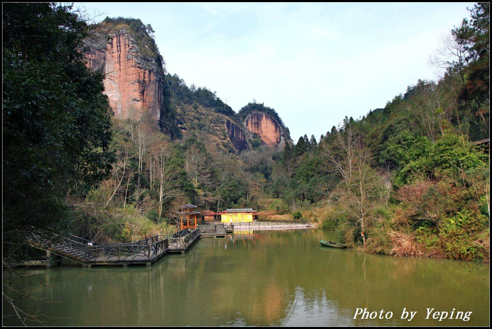
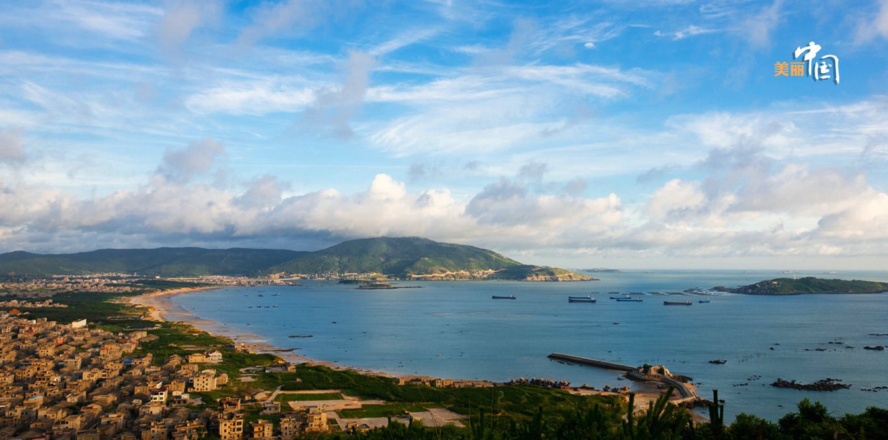

# fujian

http://www.fj.gov.cn/

福州市 fuzhou 2020-09-09 三坊七巷 http://www.fjta.com/travels/detail/124

福州、林平之老家哈哈，福州路过一次，三坊七巷还是值得去看看的。

厦门市 xiamen 2020-09-09 鼓浪屿 https://zhuanlan.zhihu.com/p/37310113

厦门最有名的没有别的地方，鼓浪屿，不遑多让。

漳州市 zhangzhou 2020-09-09 土楼 http://www.fjta.com/scenic/picture/43

> 福建土楼，也是知名景点，可以去看看，还有云水谣，这地方的标志还是很多的。

泉州市 quanzhou 2020-09-09 南少林 http://www.shphoto.com.cn/News/162

> 尚武之地，南北少林。

三明市 sanming 2020-09-09 泰宁地质公园 https://travel.qunar.com/travelbook/note/6169705

> 三明绿色中的绿，泰宁地质公园。

莆田市 putian 2020-09-09 湄洲岛 https://you.ctrip.com/place/meizhoudao1445940.html

> 莆田也有一个南少林，看起来也一样正牌，那就选湄洲岛来做地标吧。

南平市 nanping 2020-09-09 武夷山 https://k.sina.cn/article_2643734600_p9d94304800100mslr.html

> 浙江南部和福建北部山地较多，南平的武夷山就十分美丽，有时间安排上。

龙岩市 longyan 2020-09-09 泰安堡 https://www.sohu.com/a/200418496_103913

> 土楼，土堡，一字之差，差别特别大。土堡小而分散，交通不便，缺少保护，终究会消散。泰安堡就是龙岩土堡的典型。

宁德市 ningde 2020-09-09 太姥山 http://www.517time.com/html/jqdt/649.html

> 太姥山，这个字念母，山的形状比较有特色，宁德还有霞浦以水著名。

平潭综合试验区 pingtan 2020-09-09 平潭岛 http://photo.cntv.cn/mlzg/2015/46/index.shtml

> 福州往海上走有一个岛，平潭岛，是距离台湾最近的县份，离新竹近68海里。

