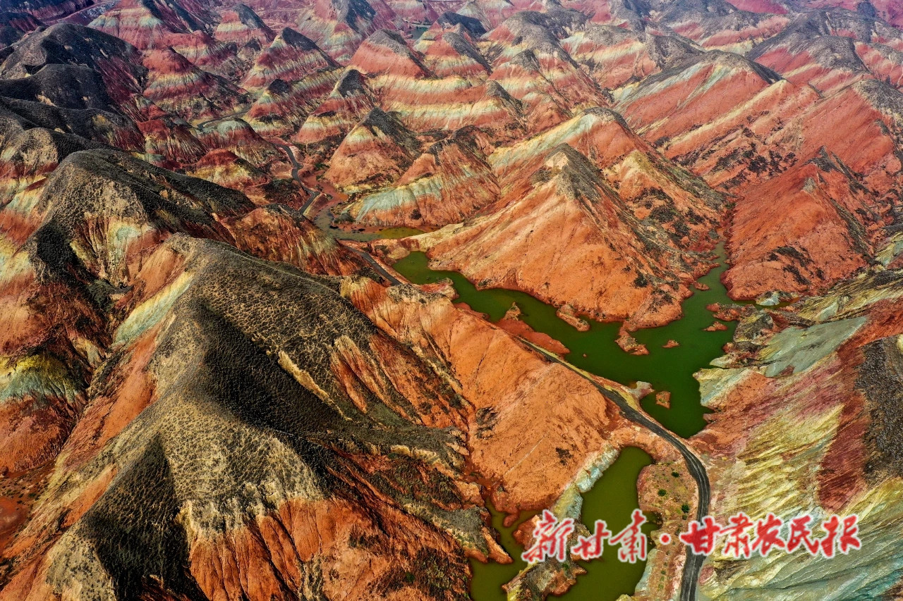
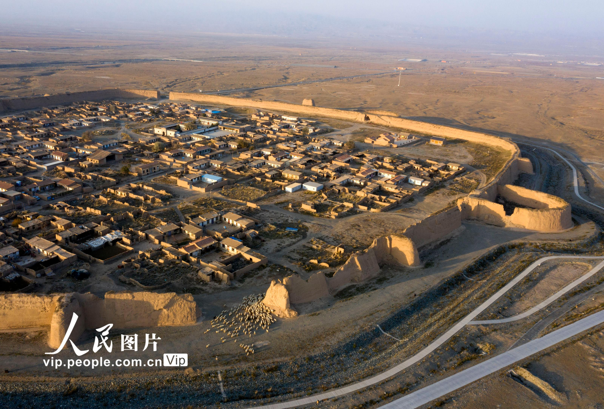

# gansu

http://www.gansu.gov.cn/

甘肃以古甘州（今张掖）、肃州（今酒泉）两地首字而得名。由于西夏曾置甘肃军司，元代设甘肃省，简称甘；又因省境大部分在陇山（六盘山）以西，而唐代曾在此设置过陇右道，故又简称为陇。

甘肃位于我国版图内陆西北部，地处黄河上游，总面积42.58万平方公里，居全国第七位。介于北纬32°31′－42°57′、东经92°13′－108°46′之间。东接陕西，南邻四川，西连青海、新疆，北靠内蒙、宁夏并与蒙古国接壤。

兰州市 lanzhou 2022-08-05 水墨丹霞 https://i.ifeng.com/c/89XAXm6YuRw

> 兰州，是西北第三大城市，应该是仅次于西安和乌市吧。一直在听说张掖丹霞，不过这个兰州的水墨丹霞也不错，看起来。狭长的城市，黄河穿城而过。

嘉峪关市 jiayuguan 2022-08-08 嘉峪关 https://www.haohua.com/jiayuguanxianhua/info.html

> 嘉峪关，四个不设区的地级市之一。万里长城的最西端。傲立在大漠之上，充满了沧桑。人口只有二十多万，被酒泉市包着，但是地理位置确是冷兵器时代的王者。

金昌市 jinchang 2022-08-10 火星1号基地 https://gs.ifeng.com/c/7zDhnzx9R8S

> 一个神秘的古罗马传说，有点假了，还是这个火星基地有点意思。

酒泉市 jiuquan 2022-08-22 莫高窟 https://ls.chiculture.org.hk/tc/passing-the-torch/369

> 酒泉的名胜实在太多了，莫高窟相比月牙泉、鸣沙山应该价值更大，更有名声。艺术价值极高，单独一个窟都有很高的鉴赏价值。

张掖市 zhangye 2022-08-22 平山湖大峡谷 http://k.sina.com.cn/article_2133856620_p7f30116c02700icg2.html?from=travel

> 名为湖，其实一点水也没有，要去玩也得准备充足的干粮和水。身处数亿年之久的岩石断层中，体会人类的渺小。

武威市 wuwei 2022-09-03 雷台汉墓 https://inf.news/zh-my/travel/45bee344e96296bfeb728f2c3dd52152.html

> 武威，西凉，保留了汉族的血统。学习了一段历史，了解了前凉的不容易。铜马还是中国的旅游标志，也算是必到之地了，只是在文革期间被发现，然后被破坏也属实可惜。个人认为前凉割据政权的王的可能性还是挺大的。

白银市 baiyin 2022-09-13 永泰古城 https://www.zhangzs.com/271984.html

> 白银，产有色金属。永泰古城，是景泰县，和中卫是挨着的，都在大沙漠边上。即将消失的400年前的原生态明朝古城，曾驻军2000人以上。

天水市

平凉市

庆阳市

定西市

陇南市

甘南州

临夏州