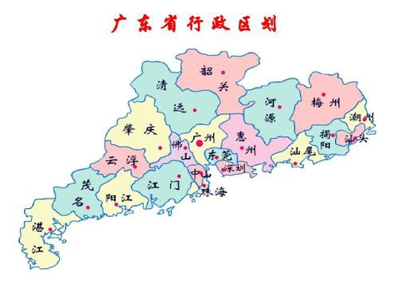

# guangdong

http://www.gd.gov.cn/

广东省位于中国大陆最南部，陆地面积17.98万平方公里，海岛面积1592.7平方公里，南临南海，大陆海岸线总长3368.1公里，岛屿众多。全省地处低纬度，北回归线横贯陆地中部。2122公里长的珠江为中国第三大河流，珠江三角洲土地肥沃，是著名的鱼米之乡。

广州市 guangzhou 2020-11-25 黄埔军校 https://kuaibao.qq.com/s/20181103A14JJV00?refer=spider

> 黄埔军校是中国近代史上不可能绕过的地方，决定了中国的命运。

深圳市 shenzhen 2020-11-26 中英街 https://www.fliggy.com/content/d-216249543114?ttid=seo.000000576&seoType=origin

> 一直以为深圳和香港只是隔着一条河，原来有一段长不足500米的陆上连接区，特区中的特区，现在去这里还需要办手续，100多年前的屈辱地。

珠海市 zhuhai 2020-11-27 外伶仃岛 马蜂窝

> 珠海的长隆就算了，游乐场所而已。这个外伶仃岛位置很特别，位于香港岛以南，距离香港水域线只有几公里可以，是可以看到香港本岛最近的大陆岛屿。加上文天祥的“零丁洋里叹零丁”以及“人生自古谁无死，留取丹心照汗青”这样的千古绝句，ok，就是这了。

汕头市 shantou 2020-11-28 南澳岛 http://bbs.zol.com.cn/dcbbs/d184_41086.html

> 汕头市的南澳岛是广东唯一的县级岛，郑成功在此招过兵，也是从这里出发赶走荷兰人，收回了台湾。自然风光优美，有山有水，也有着悠久的驻军历史。

佛山市 foshan 2020-11-29 祖庙 https://touch.travel.qunar.com/comment/10162560794?bd_source=3w

> 佛山无影脚，儿时的记忆，佛山的祖庙标示了佛山地名的由来，紧紧挨着祖庙的是黄飞鸿纪念馆和叶问纪念馆，两位武术大师。北沧州，南佛山。

韶关市 shaoguan 2020-11-30 丹霞山 https://www.sohu.com/a/114543199_474420

> 一直以为这个城市是湖南的，没想到是广东的。丹霞山和其他国内丹霞地貌的山一起入选了世界自然遗产。这山还有久仰大名的阳元石，阴元石。

河源市 heyuan 2020-12-01 新丰江水库 https://www.sohu.com/a/116091096_445672

> 河源，南越王赵佗建城之地，传奇人物，百越之首。越和粤有什么演变历史吗？新丰江水库颇有点千岛湖的感觉。

梅州市 meizhou 2020-12-02 花萼楼 https://touch.travel.qunar.com/comment/5774445

> 没看过《大鱼海棠》，据说花萼楼出现在那部动画里。梅州被称为世界客都，那么就放弃那什么千佛塔、爱丽斯庄园了，选了一个标准圆形的花萼楼。

惠州市 huizhou 2020-12-03 西湖 https://touch.travel.qunar.com/comment/6187184?from=yun

> 杭州西湖、颍州西湖、惠州西湖，虽然全国西湖有30多个，但是一个杭州占尽天下先，同为5A景区的惠州西湖风景也不逊色。很多古诗里面的西湖其实并不是杭州的西湖。

汕尾市 shanwei 2020-12-04 红宫 http://pc.nfapp.southcn.com/59/4343521.html

> 汕尾，名气感觉还不如海陆丰来得响亮，海丰，陆丰是汕尾的下辖县市，红宫红场是中共建立的第一个苏维埃政权所在。

东莞市 dongguan 2020-12-05 可园 http://mini.eastday.com/a/191122174132058-2.html

> 保存最为完好的岭南四大园林之一，主人是屡被天地会清朝按察使，罢官之后回乡修园子，甚至不惜借贷修。主人还广邀文人墨客，使其地成为一个文化策源地。

中山市 zhongshan 2020-12-06 阜峰文笔 https://k.sina.com.cn/article_2943269702_af6ebb4600100o983.html?from=travel&sudaref=www.google.com&display=0&retcode=0

> 中山原名香山，因为与孙中山的关系，这个城市改名为了中山，阜峰文笔就是旧中山八景仅存的之一，新选择的中山八景基本都围绕中山先生而来了。

江门市 jiangmen 2020-12-07 瑞安楼 https://new.qq.com/omn/20190603/20190603A0N3NA.html

> 一开始就觉得这个碉楼挺有意思的，没想到是《让子弹飞》的拍摄地，怪不得有点眼熟。民国时期，匪患严重，乡民不得不造碉楼自治，保护自己的财产和生命。

阳江市 yangjiang 2020-12-08 海陵岛 http://53msw.com/m/view.php?aid=1792&pageno=2

> 阳江就是一个阳光海滩城市，既有古迹，又有现代风光，海陵岛的海岛风还是很赞，阳江还有一个不是特别大的山洞。

湛江市 zhanjiang 2020-12-09 湖光岩 http://www.ucxinwen.com/image/12707505151.html

> 独占一个半岛的地级市，湖光岩是一个火山口形成的，大龟造型很是好玩。

茂名市 maoming 2020-12-10 放鸡岛 https://www.baike.com/wiki/%E6%94%BE%E9%B8%A1%E5%B2%9B?view_id=55oazuth21o000

> 这个岛的名字就很有意思，现在还有改名为潜梦岛，如果恰好路过，可以去转转。

肇庆市 zhaoqing 2020-12-11 七星岩 http://www.xn--dkr744byha5k854adf.com/doc/2017/11/17/5.shtml

> 肇庆和宋徽宗还有着潜在的关联，七星岩4A景区，有着大大小小的溶洞。肇庆还曾经一直说两广总督衙门所在地。

清远市 qingyuan 2020-12-12 慧光塔 http://www.cunman.com/new/383b18b3519b4c27a699a63dc7167860

> 惠州古塔无影，连州古塔无盖，也算是一个IP了，清远连州的慧光塔比比萨斜塔还要早建成700年，不过名气就因为文化加持的原因差远了。

潮州市 chaozhou 2020-12-13 广济桥 http://www.win4000.com/wallpaper_detail_151801_4.html

> 好花哨的桥啊，据称是古代四大名桥之一，与赵州桥齐名。

揭阳市 jieyang 2020-12-14 揭阳学宫 https://touch.travel.qunar.com/comment/5752077

> 其实是一个始建于南宋的孔庙，也因为与党的早期领导人有些渊源才没有再十年动乱期间被毁损太厉害，规模仅次于曲阜孔庙。

云浮市 yunfu 2020-12-15 大湾古建筑群 https://k.sina.cn/article_2991875983_pb254678f027012gxc.html

> 云浮，名字很仙气，位于粤西，这些古建筑看起来也不甚显眼，内里的雕塑不像普通的民居，一般都是祠堂。

