# guizhou

贵州省

贵州简称“黔”或“贵”，辖6个地级市、3个自治州，共有88个县(市、区、特区)，国土面积17.6万平方千米，其中民族自治地方占全省总面积的55.5%，据全国第六次人口普查，全省常住人口3475万人，少数民族人口占全省总人口的36.1%，是一个山川秀丽、气候宜人、资源丰富、人民勤劳、少数民族聚集、发展潜力很大的省份。

贵州省官方网站 http://www.guizhou.gov.cn/

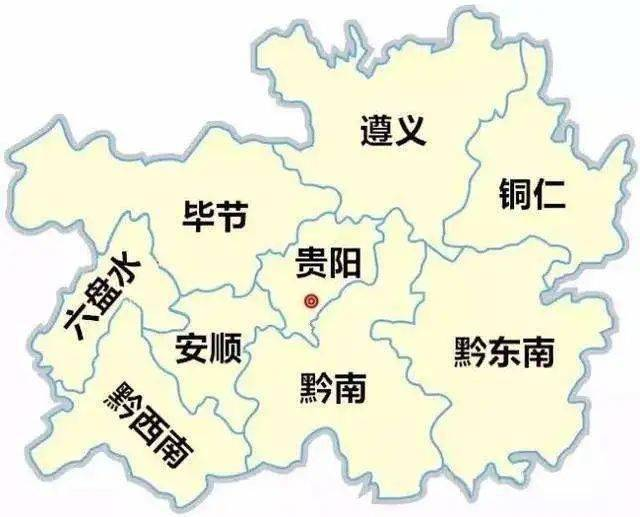

贵阳市 guiyang 2021-06-21 花溪黄金大道 http://k.sina.com.cn/article_5392590366_p1416c661e02700k9os.html?cre=tianyi&mod=pcpager_focus&loc=3&r=9&rfunc=100&tj=none&tr=9

> 花溪黄金大道，500M长的网红大道。千年银杏，景观是不错。

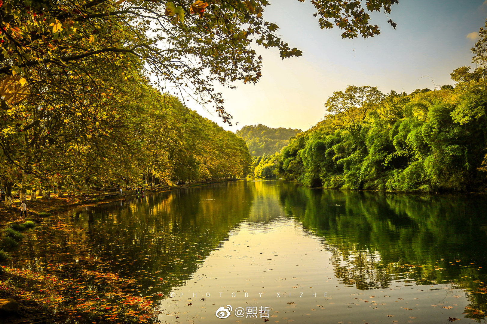

贵阳市 guiyang 2021-07-05 甲秀楼 https://commons.wikimedia.org/wiki/File:%E7%94%B2%E7%A7%80%E6%A5%BC_-_Jiaxiu_Pavilion_-_2015.07_-_panoramio.jpg

> 夜郎国的典故甚是有趣，贵阳最有名的居然就是一个巨石上建成的小楼——甲秀楼？也不是千年古迹，也不甚巍峨。

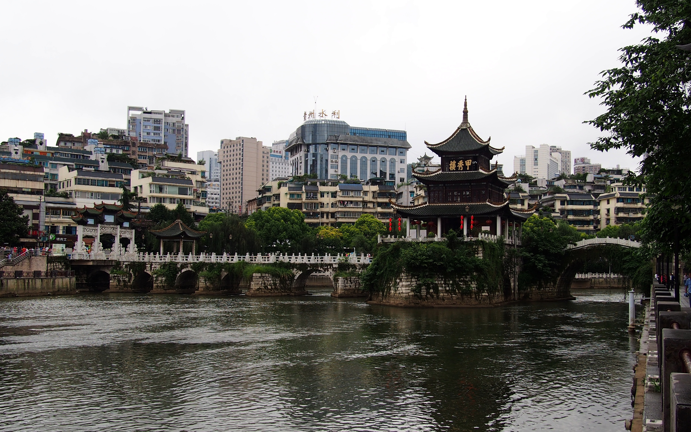

遵义市 zunyi 2021-07-12 赤水河 https://min.news/food/5ecb38c79ccec9429412f2a4fda684b1.html

> 茅台和郎酒的母亲河，遵义是一个非常重要的地点。四渡赤水的故事以后有机会还是要多了解了解。

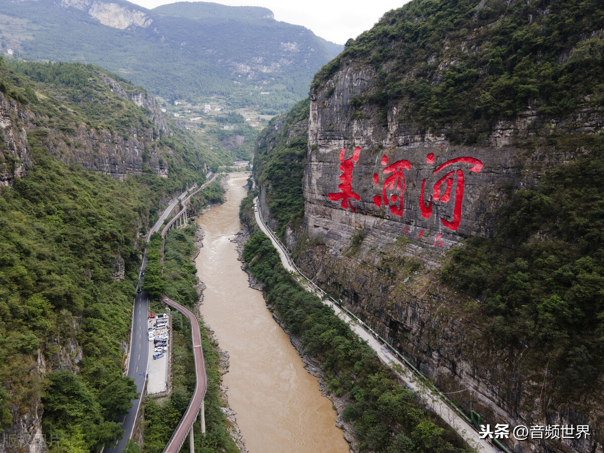

六盘水市 liupanshui 2021-07-22 乌蒙大草原 https://www.sohu.com/a/404152776_437595

> 这个城市的名字本来以为是某条江河的名字起的，原来是三个地方头字的拼合。看到排在第一的景点是大草原是，我一度以为是蒙古有同名的地方，谁知道真的是西南高原上也有大草原，甚是惊异。

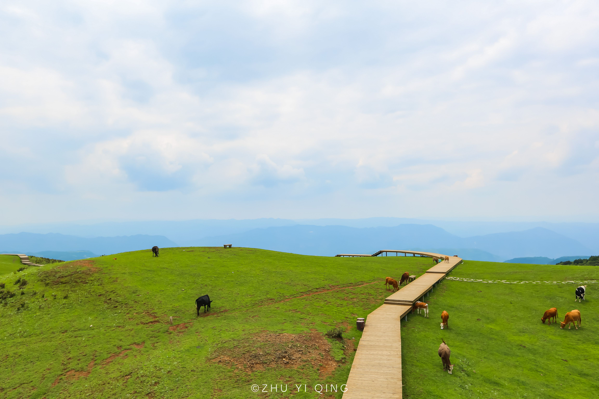

安顺市 anshun 2021-07-27 黄果树瀑布 http://jmssly.com/xlxq/2487.html

> 黄果树大瀑布，以前经常看到，也许是我爸的香烟上，谁知道和安顺市有关联，主要是雄奇秀。

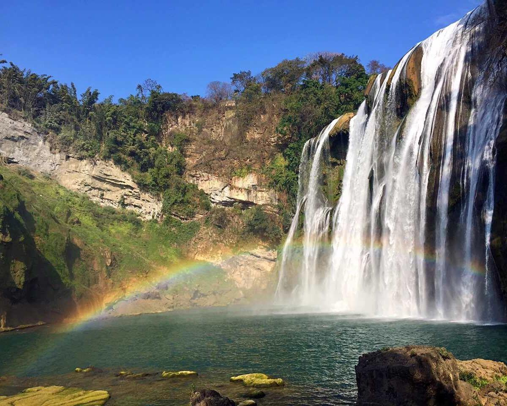

毕节市 bijie 2021-08-01 大屯土司庄园 https://zhuanlan.zhihu.com/p/24594648

> 即看到了数年前的名新闻，又看到了一个跌宕起伏的故事，彝族最后土司的故事很吸引人。百十个人就可以雄霸一方了。

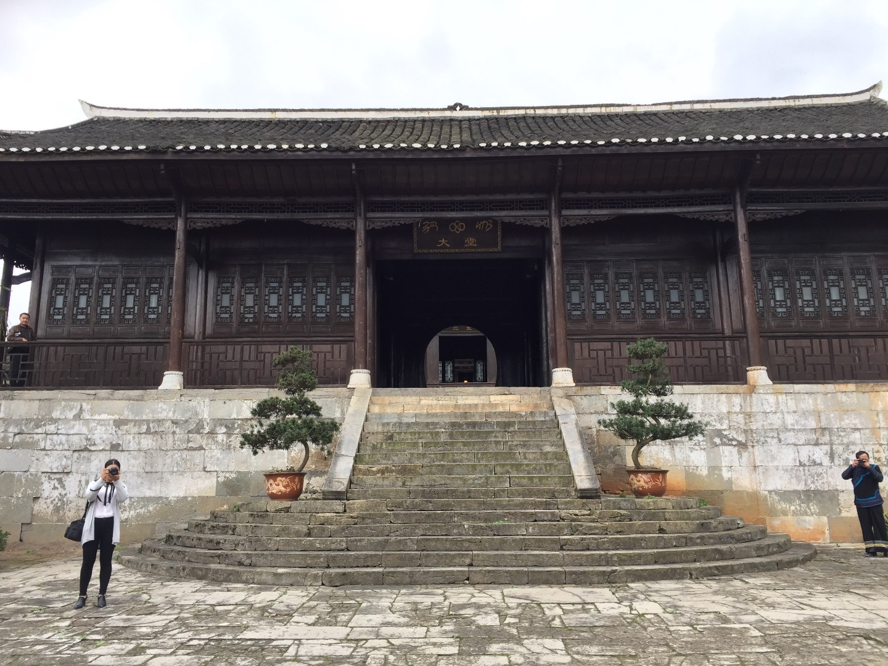

铜仁市 tongren 2021-08-08 梵净山 https://jingyan.baidu.com/showlist/detail/cb5d61052bffc7005c2fe0bd

> 原来以前电视上看过的山在这里，有生之年一定要去爬爬看，东西南北都爬一遍。直上直下没有电梯，爬一次不知道要耗费多久呢。

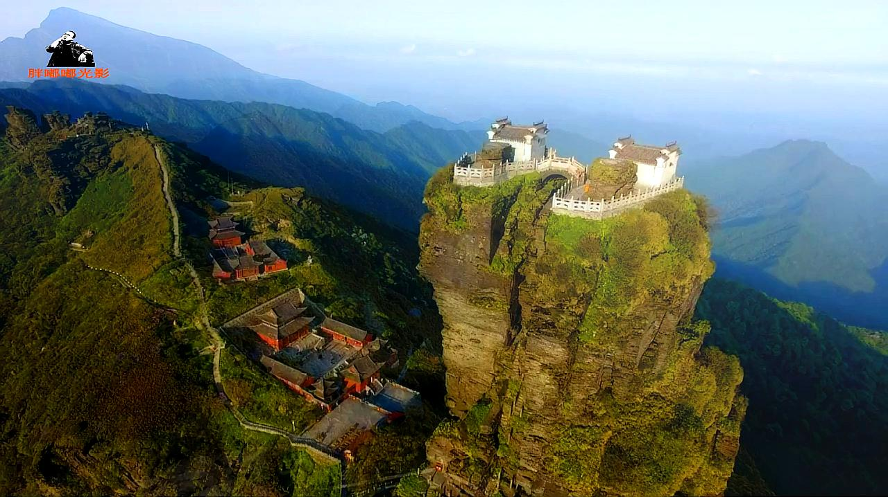

黔东南州 qiandongnan 2021-08-15 镇远古城 https://www.zhdate.com/news_travel/6293.html

> 黔东南，一个生疏的名字，其实历史一点不简单，镇远古城是一个多文化大融合的古镇，20年刚升级为5A景区，相对于芭沙苗寨，这里的建筑风景更美一点。

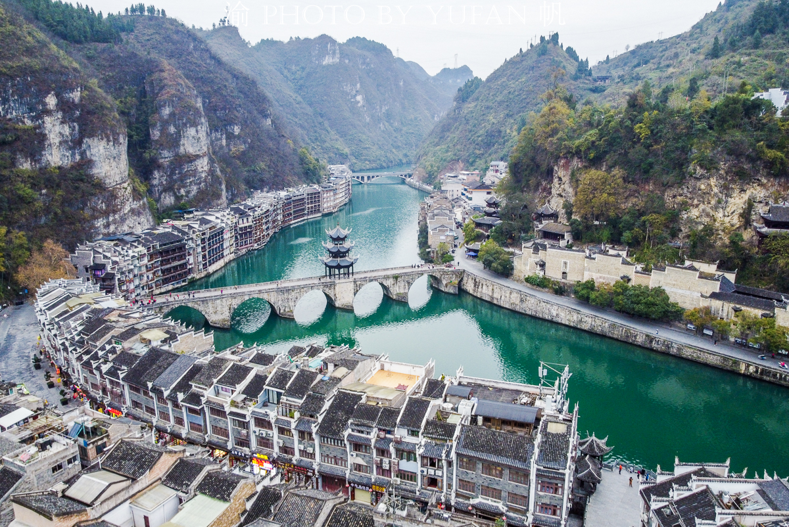

黔南州 qiannan 2021-08-23 福泉古城墙 http://www.9797363.com/view/20200102/32418.html

> 56个民族并非一直相处融洽，因为苗民动乱，平越一度因为缺水死伤惨重，以至后来万历年间，城墙再度扩建，将河道一段纳入城墙范围内。有两个家喻户晓的人物和福泉也有关联，张三丰和沈万三，很是神奇。

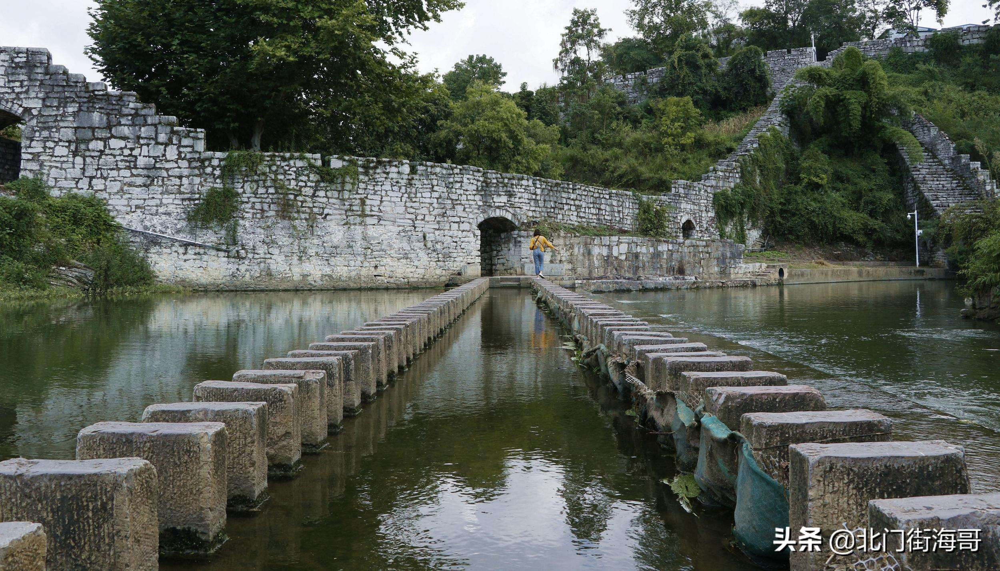

黔西南州 qianxinan 2021-08-29 二十四道拐 https://www.sohu.com/a/257957451_100236562

> 一段有温度的记忆，二战时的生命线，惊险刺激的公路，长期驻扎的美军工兵。旁边的晴隆古城也是可以一去的所在。

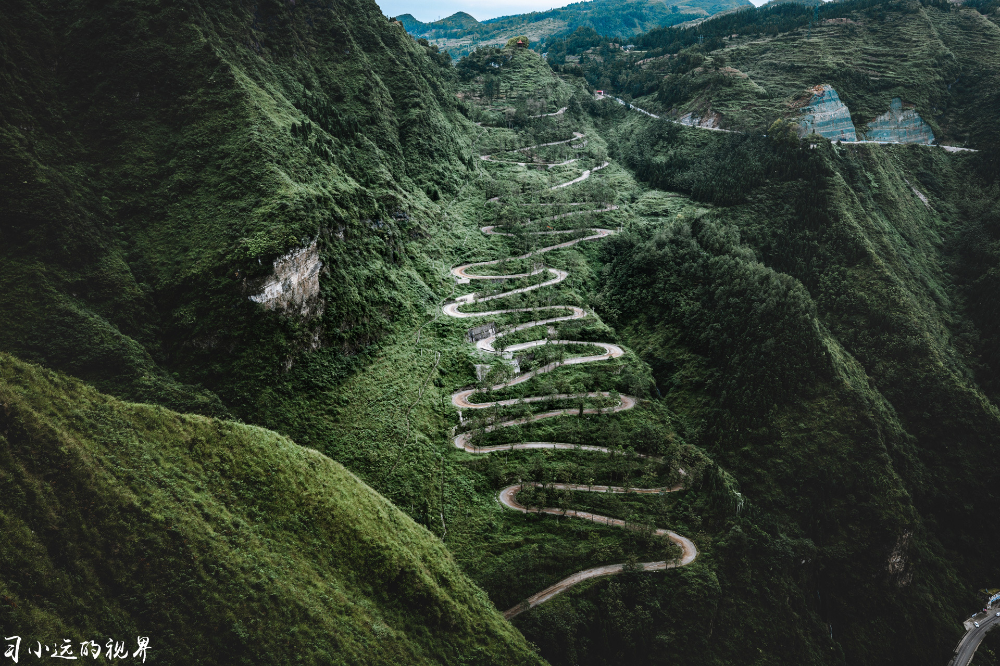

贵安新区 guian 2021-10-17 云漫湖 http://xf.house.163.com/gy/photo/COJG.html

> 新区实在不好找景点，看起来当地比较知名的就是这个云漫湖了，其实是在安顺境内，图片还是在售房网站上找的。贵州打造成瑞士！

