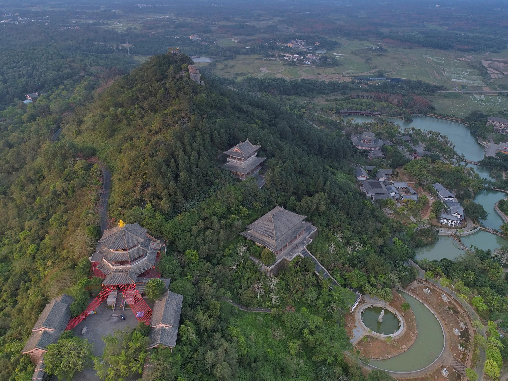

# hainan

http://www.hainan.gov.cn/

海南省位于中国最南端，北以琼州海峡与广东省划界，西临北部湾与越南民主共和国相对，东濒南海与台湾省相望，东南和南边在南海中与菲律宾、文莱和马来西亚为邻。海南省的行政区域包括海南岛和西沙群岛、中沙群岛、南沙群岛的岛礁及其海域。全省陆地（包括海南岛和西沙、中沙、南沙群岛）总面积3.5万平方公里，海域面积约200万平方公里。海南岛形似一个呈东北至西南向的椭圆形大雪梨，总面积（不包括卫星岛）3.39万平方公里，是我国仅次于台湾岛的第二大岛。海南岛与广东省的雷州半岛相隔的琼州海峡宽约18海里，南沙群岛的曾母暗沙是我国最南端的领土。

海口市 haikou 2020-12-30 骑楼老街 https://www.sohu.com/a/373799109_384664

> 海南人口稀少，骑楼老街是一种源自希腊的建筑风格，具有异域特色。

三亚市 sanya 2020-12-31 天涯海角 http://hainan.ifeng.com/app/sanya/detail_2015_05/25/3931786_0.shtml

> 去三亚，不得不去天涯海角，以及吃海鲜。当然，如果能去三沙就更厉害了。

三沙市 sansha 2021-01-01 永乐蓝洞 https://www.twoeggz.com/picture/7433993.html

> 三沙，中国面积最大的地级市，也是人口最少，陆地面积最小的。这个蓝洞号称是目前已知最深的，达到300多米。

儋州市 danzhou 2021-01-02 东坡书院 https://k.sina.cn/article_1477137874_p580b55d200100jxfc.html

> 《庆余年》里的儋州是虚构的，现实中的苏轼最远曾经被发配到海南，热带气候的书院也是少见。曾经未开化的蛮荒之地，如今已成为热闹的旅游景点。

琼海市 qionghai 2021-01-03 万泉河 http://bbs.zol.com.cn/dcbbs/d34040_6881.html

> 万泉河水清又清，留下了一个中国微缩版亚马逊河。

文昌市 wenchang 2021-01-04 航天发射场 https://cbgc.scol.com.cn/news/557741

> 酒泉、文昌，感觉现在文昌航天发射场使用的频率越来越高了。

万宁市 wanning 2021-01-05 分界洲岛 https://www.sohu.com/a/301232933_118685

> 海水清澈，有待肉身亲自去验证。

东方市 dongfang 2021-01-06 鱼鳞洲 http://www.bajieyou.com/new/32028bb2c19041a2a1f1831da72dd4b6

> 海边有巨石，异常凸起。城市的名字也很东方。

五指山市 wuzhishan 2021-01-07 五指山 https://zh.wikipedia.org/wiki/%E4%BA%94%E6%8C%87%E5%B1%B1_(%E6%B5%B7%E5%8D%97)

> 五指山市原来叫通什（za），后来改此名，相传孙悟空就是压在此山下（哈哈），网上找到一些五座山峰的照片，但是分辨率太低。

乐东黎族自治县 ledong 2021-01-08 佳西村 http://hainan.sina.cn/zimeiti/z/2018-09-26/detail-ifxeuwwr8317502.d.html

> 海南少数民族村庄，景色优美。

澄迈县 chengmai 2021-01-17 济公山 https://you.ctrip.com/travels/hainan100001/1724542.html

> 历史悠久的县市，济公本是浙江人，这海岛之中尽有许多奇石与之相对应。奇哉，也需要些许想象力。

临高县 lingao 2021-01-18 临高角 http://news.hainan.net/photo/hainan/xiaotu/2019/08/06/4068751_1.shtml#page2

> 1950年，解放军登陆海南的地方，百年灯塔，见证海南岛的新历史。

定安县 dingan 2021-01-19 文笔峰 https://k.sina.cn/article_2255392750_p866e8fee00100qvgu.html

> 也是一处宗教胜地，平原中一处凸起的山丘。

屯昌县 tunchang 2021-01-20 海瑞祖居 https://kuaibao.qq.com/s/20200518AZPT0K00?refer=spider

> 海南的县都不大，屯昌也是成立不到100年的城市，人口几十万，不过历史上这里出过一个大名人，那就是明朝的海青天——海瑞。

陵水黎族自治县 lingshui 2021-01-21 南湾猴岛 https://m.weelv.com/qa/10238/11798.html

> 比较有特色的猕猴保护景区，陵水还发生过中美战机空战的事。

昌江黎族自治县 changjiang 2021-01-22 信冲洞 http://www.cjxbwg.com/noww.asp?id=7

> 上世纪末发现的化石丰富的遗址，远离人类活动范围才容易保存相对完好。

保亭黎族苗族自治县 baoting 2021-01-23 槟榔谷 https://zhuanlan.zhihu.com/p/70616126

> 海南以黎族和苗族居多，槟榔谷不知道是不是人造的景点，不过5A是名副其实的。了解海南原生态文化可以去的。

琼中黎族苗族自治县 qiongzhong 2021-01-24 百花岭 http://hainan.sina.com.cn/news/comprehensive/2020-08-19/detail-iivhuipn9438364.shtml

> 热带就应该有热带的气质，琼中也是一个黎族和苗族为主的地区，百花岭，主打雨林文化的4A景区。

白沙黎族自治县 baisha 2021-01-25 陨石坑 https://www.pinchazhe.com/cydq/lvcha/20200610/11198.html

> 70万年前的陨石撞击产生了这个坑，如今已是一个大型茶叶农场。据称有一些神秘现象，不知真假。

