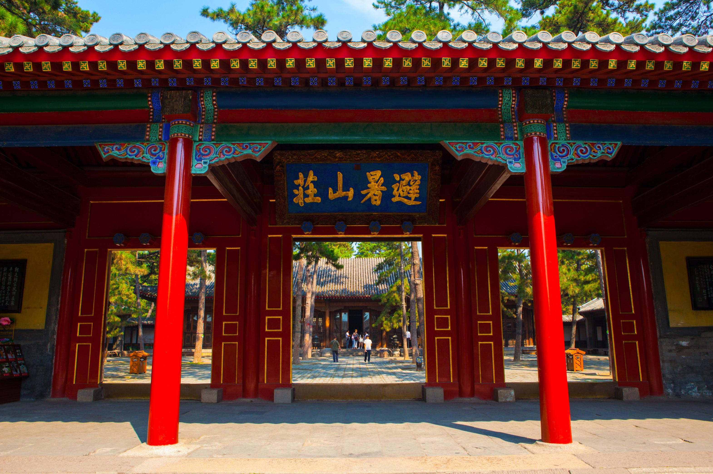

# hebei

河北省

河北省地处华北平原，兼跨内蒙古高原。全省中环首都北京和北方重要商埠天津市，北与辽宁、内蒙古为邻，西靠山西，南与河南、山东接壤，东临渤海。海岸线长487公里。总面积18.8万平方公里。

河北省官方网站 http://www.hebei.gov.cn/

顺序：

石家庄 shijiazhuang 2020-08-22 西柏坡 http://www.abcwxh.com/travel/181956.html

> 选择了西柏坡作为壁纸来源，考虑到西柏坡在中国历史上的地位。

承德 chengde 2020-08-22 避暑山庄 http://www.ucxinwen.com/image/63887721547.html

> 承德避暑山庄毫无疑问是这一壁纸的唯一来源。

张家口 zhangjiakou 2020-08-22 鸡鸣驿 http://www.xcditu.com/view/6474.html

> 倾向于挑选有人文背景的景点地标，放弃了草原天路，选择了鸡鸣驿。

秦皇岛 qinhuangdao 2020-08-22 北戴河 http://heb.hebei.com.cn/system/2019/10/31/100087129.shtml

> 当之无愧北戴河，新一代的避暑山庄。

唐山 tangshan 2020-08-22 清东陵 http://www.lvmama.com/lvyou/photo/d-tangshanqingdongling102947.html

> 本来想找个大地震的，后来放弃了，还是找个历史遗迹吧，同时风景还可以的，清东陵。

廊坊 langfang 2020-08-22 胜芳古镇 https://travel.qunar.com/travelbook/note/7410604

> 印象当中除了廊坊大捷，也没啥特别深刻的了，查了查历史，廊坊一直是京城直接管辖的地方，现在归到河北。选了胜芳古镇，北方水乡。

保定 baoding 2020-08-22 白洋淀 http://heb.hebei.com.cn/system/2019/11/16/100103521.shtml

> 除了保定士官学校，就是白洋淀了。革命老区。

沧州 cangzhou 2020-08-22 无 http://www.czswly.cn

> 沧州两个标志：武术和杂技，这里选取了沧州的武术。

衡水 hengshui 2020-08-22 衡水湖 http://hs.hebnews.cn/2020-02/21/content_7711707.htm

> 衡水绕不过去的就是老白干和衡水中学，查了半天没有高清的衡水中学的图片，后来想想桌面壁纸看什么中学图片啊，于是转头分分钟找了一种衡水湖候鸟迁徙图。

邢台 xingtai 2020-08-22 白云洞 https://www.sohu.com/a/380578017_246796

> 对于邢台，除了邢钢，其他我了解的并不多，今天了解到还有一个崆山白云洞，记录一下。

邯郸 handan 2020-08-22 白菜  http://www.mychinanews.com/news/n/1/2076423

> 两千多年没有改过名字的历史名城，历史肯定很多，但是目前吸引我的还是那一颗“白菜”，民以食为天啊。

辛集 xinji 2020-08-22 皮革 https://www.sohu.com/a/201383403_807570

> 貌似这里的皮革比较有名，凑个数吧。

定州 dingzhou 2020-08-22 定州古城 https://k.sina.cn/article_2643734600_p9d94304800100mrvl.html

> 定州古城，夹在石家庄和保定之间的城市。

河北11个城市，2个省直管县级市收集完毕。