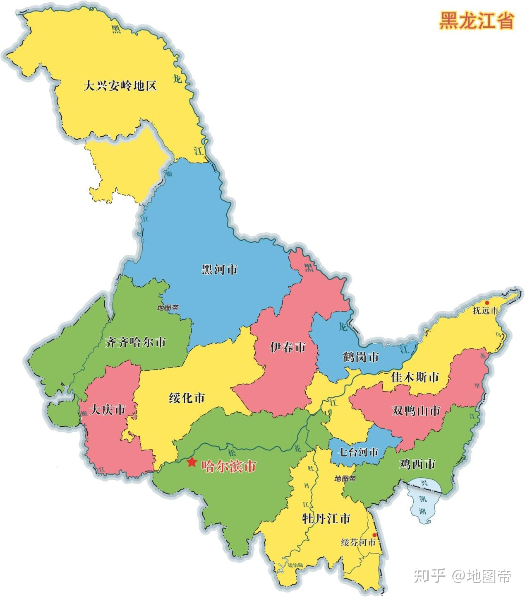
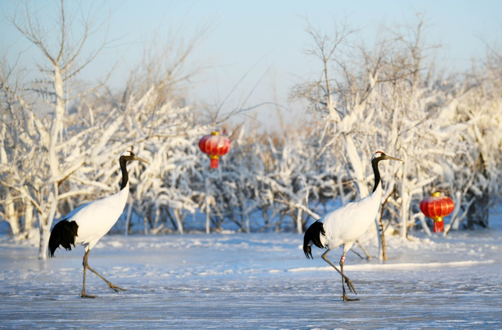
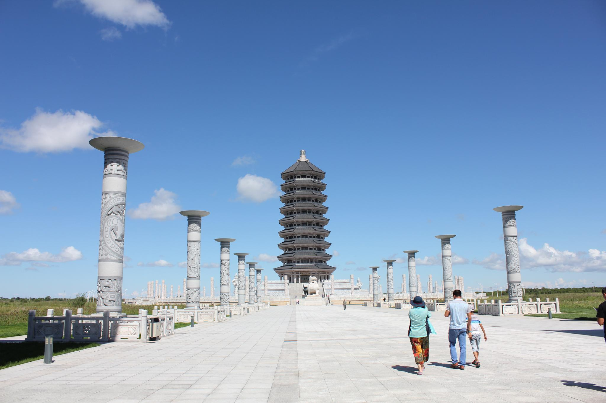
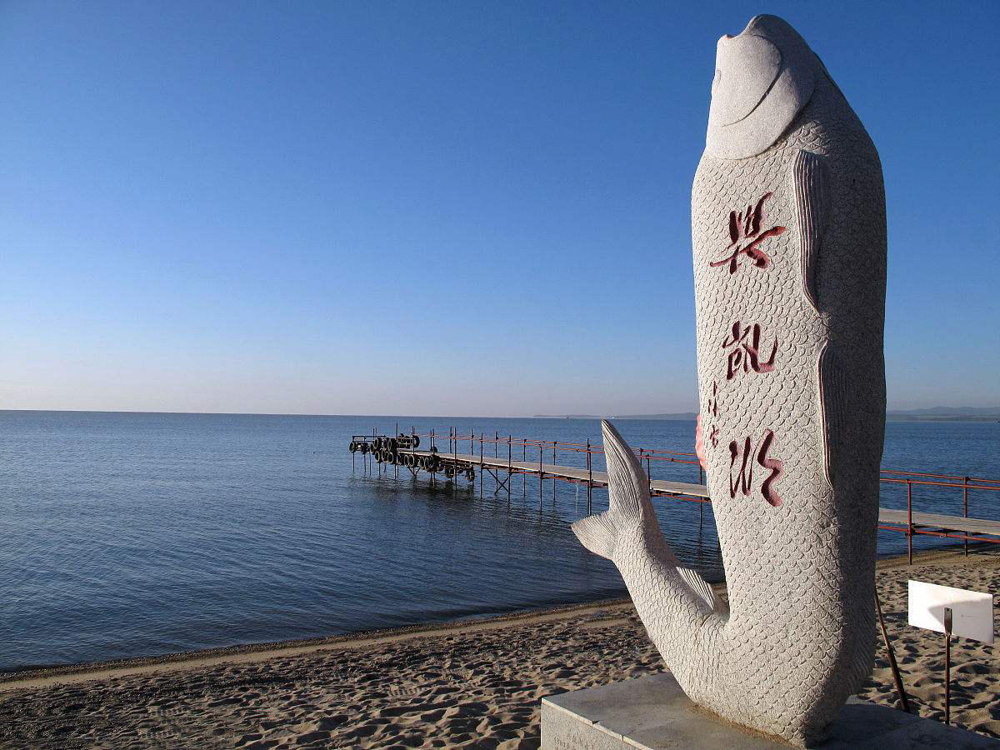
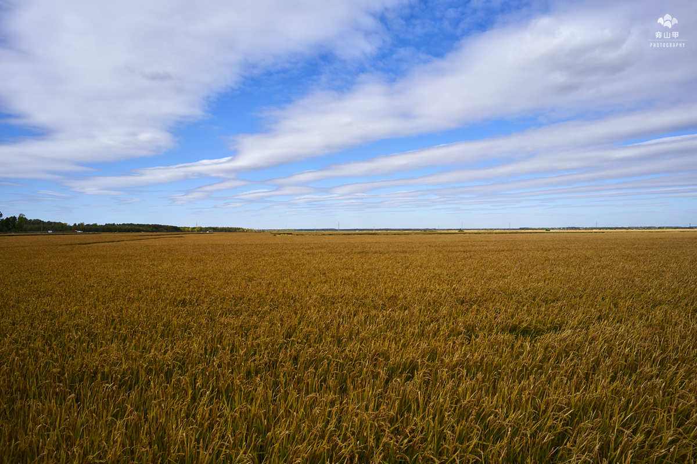
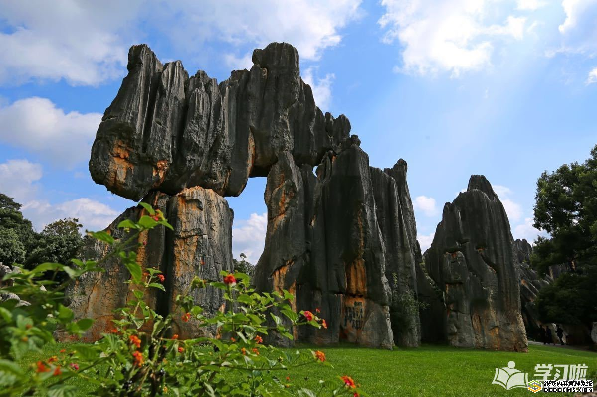
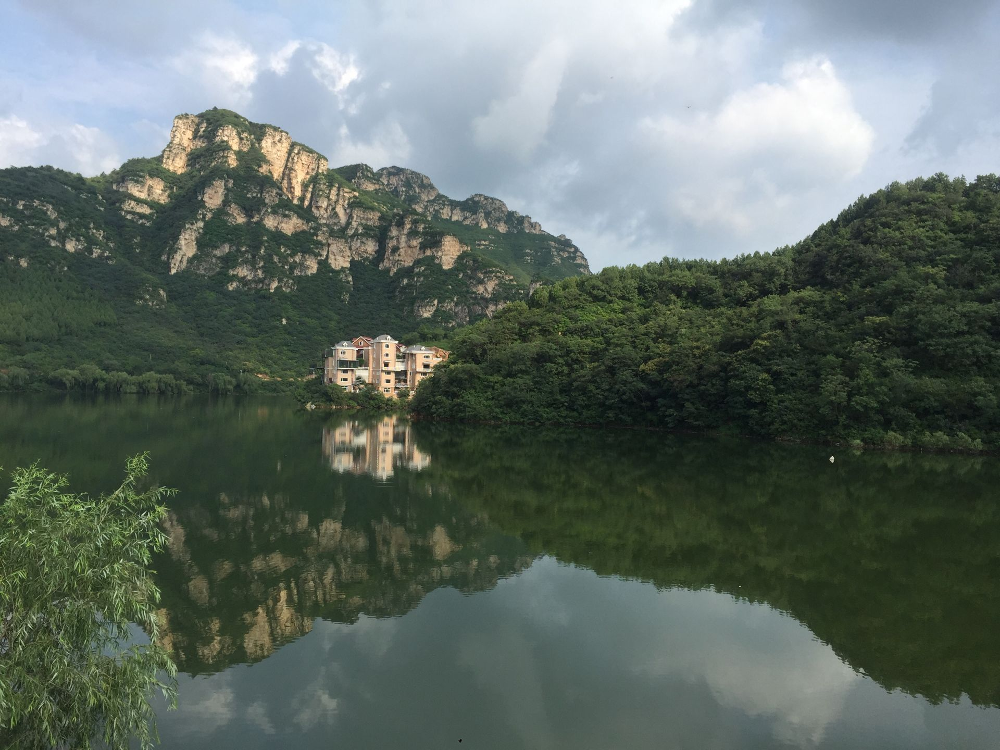
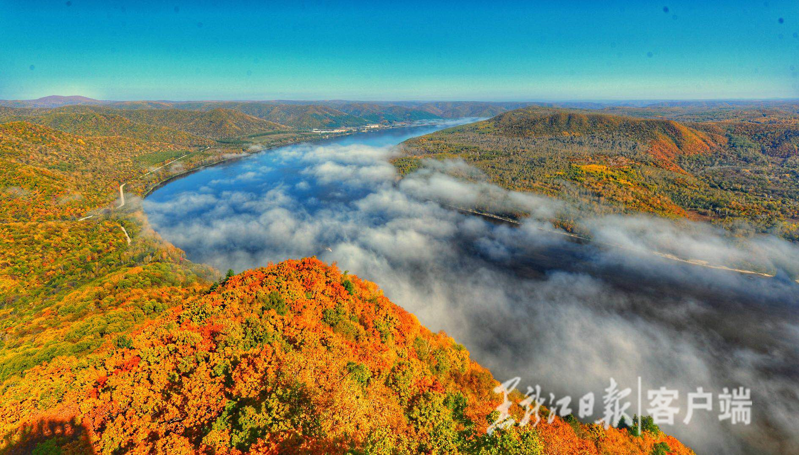
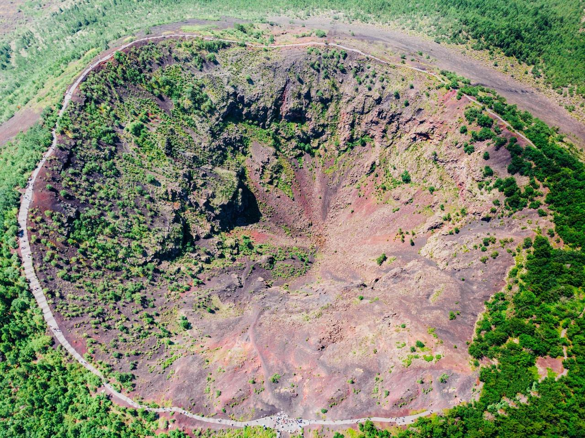
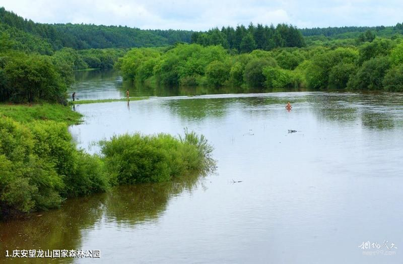

# heilongjiang

http://www.hlj.gov.cn/

黑龙江省有着悠久的历史。公元前4世纪至公元前3世纪，就有夫余政权建立，地跨今黑龙江省南部。唐代设渤海都督府、黑水都督府、室韦都督府。辽时归东京道管辖。金时属上京道管辖。元设开元路、水达达路。明设奴儿干都司。清设黑龙江将军和吉林将军，管辖黑龙江地区。新中国成立后，设黑龙江省和松江省，1954年将两省合并为黑龙江省。

哈尔滨市 haerbing 2020-09-01 冰雪大世界 https://www.0311xxx.com/tuwen/3520317.html

> 印象最深的就是哈尔滨的冰雕，冰雪大世界了，太阳岛上。

齐齐哈尔市 qiqihaer 2020-09-01 扎龙自然保护区 https://twitter.com/xinhuachinese/status/1083907510065483776?lang=de

> 齐齐哈尔扎龙自然保护区，最大的丹顶鹤繁殖地，冬天会飞往中国的南方过冬。只有日本的北海道的丹顶鹤不迁徙。

牡丹江市 mudanjiang 2020-09-01 镜泊湖 https://www.mmonly.cc/gqbz/fjbz/111993_6.html

> 这里我查了好久，镜泊湖，吊水楼瀑布，夏天冬天各有一番风味。值得一游。

佳木斯市 jiamusi 2020-09-02 黑瞎子岛 https://k.sina.com.cn/article_2643734600_p9d94304800100hhz1.html

> 很有名的城市。黑瞎子岛又是具有纪念意义的一个地方。中苏。

大庆市 daqing 2020-09-02 大庆油田 http://www.sznews.com/news/content/2019-07/18/content_22268099.htm

> 每个中国人都知道的铁人，王进喜，大庆油田。

鸡西市 jixi 2020-09-02 兴凯湖 https://kuaibao.qq.com/s/20180523A0VCK600?refer=spider

> 曾经的内湖，现在变成界湖，也算一段屈辱的历史。兴凯湖。

双鸭山市 shuangyashan 2020-09-02 友谊农场 https://www.sohu.com/a/197810208_106072

> 黑土地，北大荒，友谊农场，浓浓的6、70年代风情。

伊春市 yichun 2020-09-02 汤旺河石林景区 http://www.52daoyouci.com/know/jingdian/20171018_95373.html

> 除了桂林有石林，最东北的黑龙江也有石林，汤旺河石林景区，有石头有松涛，不错不错。

七台河市 qitaihe 2020-09-02 石龙山 https://www.trip.com/travel-guide/qitaihe/shilongshan-national-forest-park-101568/

> 很小的城市，找到一篇风水文章，石龙山景色还是很好的。

鹤岗市 hegang 2020-09-02 龙江三峡 http://www.hljnews.cn/article/319/81714.html

> 龙江三峡风光不错，鹤岗除了闻名遐迩的房子，还是有一个宝藏萝北县的。

黑河市 heihe 2020-09-02 五大连池 http://www.9797363.com/view/20200108/34074.html

> 五大连池，五大湖，傻傻分不清楚。火山群的景色和一般山峰啥的还是区别很大的。

绥化市 suihua 2020-09-02 望龙山 https://www.meet99.com/jingdian-wanglongshan

> 好风景估计是有的，但是网上实在搜索不到，只有一个模糊版本的望龙山。

大兴安岭地区行政公署 daxinganling 2020-09-02 大兴安岭 https://m.soumeitu.com/8626_8.html

> 大兴安岭，全国百姓都知道，大就一个字，随便一找就是一张美图。

发现一篇不错的游记，这人也是东北逛了一大圈 https://card.weibo.com/article/m/show/id/2309404319761415731846