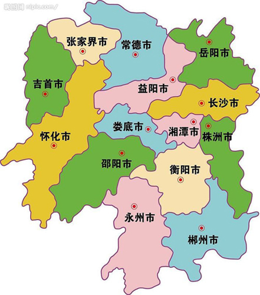
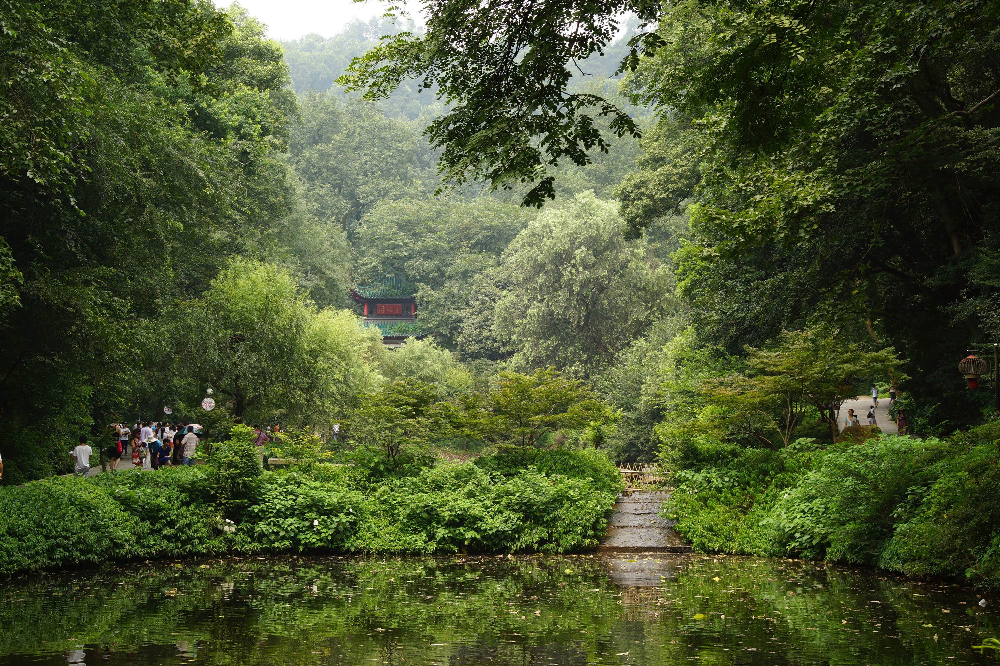
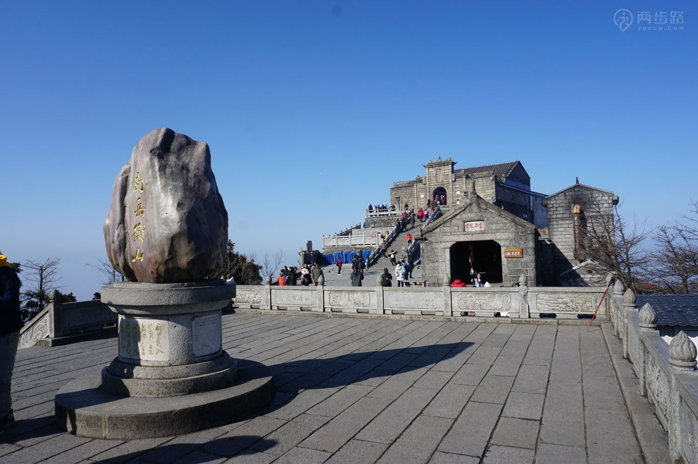
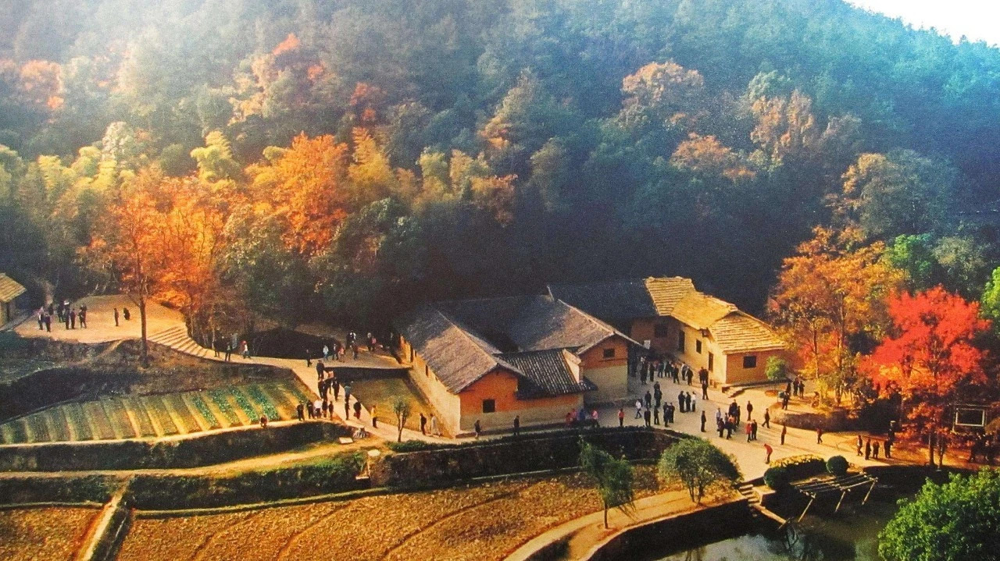
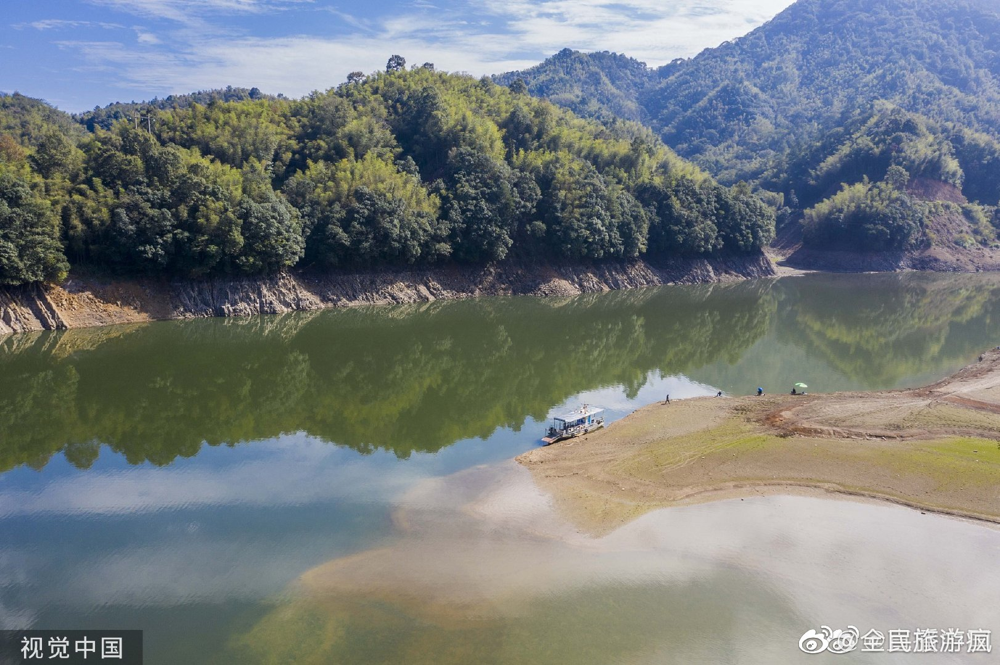
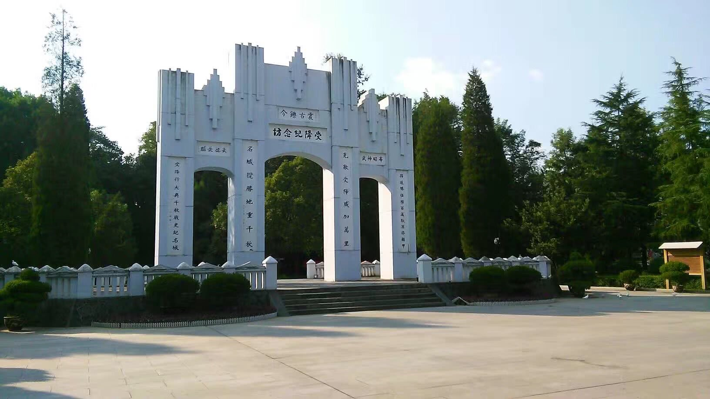

# hunan

http://hunan.gov.cn/

湖南省位于我国中部、长江中游，因大部分区域处于洞庭湖以南而得名“湖南”，因省内最大河流湘江流贯全境而简称“湘”，省会驻长沙市。湖南自古盛植木芙蓉，五代时就有“秋风万里芙蓉国”之说，因此又有“芙蓉国”之称。湖南地处东经108°47′～114°15′、北纬24°38′～30°08′，东西直线距离最宽667公里，南北直线距离最长774公里，总面积21.18万平方公里，占全国国土面积的2.2%，居全国各省区市第10位、中部第1位。

长沙市 changsha 2020-11-11 岳麓山 https://outletscn.com/news/outlets-news/alshcs/

> 岳麓山，橘子洲头，都是长沙鼎鼎大名的景点，岳麓山还是免费的。岳麓书院收费。停车坐爱枫林晚，爱晚亭就在岳麓山上。赞！

衡阳市 hengyang 2020-11-12 衡山 https://www.2bulu.com/community/gotohuatinfo.htm?id=VRcYzGNESL6iy0zj0M%2B0%2Bw%3D%3D&type=1

> 南岳衡山，寿岳，寿比南山，很吉庆的一岳。对湖南的历史地理知识需要加强，衡阳地图就像一个缩小版的湖南省。

株洲市 zhuzhou 2020-11-13 炎帝陵 https://www.sohu.com/a/313279735_428020

> 这些后造的景点本来不想搞进来的，但是想想炎帝是老老祖先，还是值得纪念一下，再说放在株洲不是没有道理的。

湘潭市 xiangtan 2020-11-14 毛泽东同志故居 https://kuaibao.qq.com/s/20180821A1BKBX00?refer=spider

> 刘少奇在长沙，毛主席在湘潭，两个城市挨着这么近却出了两位杰出的共产党领导者，神奇，毛泽东同志故居，必须得去。

邵阳市 shaoyang 2020-11-15 崀山 https://www.tp88.net/photo/201510/02/8745.html

> 崀山，这个字念lang，地形地貌也的确很有特点，邵阳还有一位名人——蔡锷，再造共和。

岳阳市 yueyang 2020-11-16 岳阳楼 http://www.yueyanglou.com/?p=592

> 岳阳，因楼而闻名，让我根本就不想去查阅其他古迹，先天下之忧而忧，后天下之乐而乐，一首《岳阳楼记》使得江南三大名楼最矮的岳阳楼熠熠生辉。

常德市 changde 2020-11-17 夷望溪 https://www.hunantoday.cn/article/201911/201911161920118684.html

> 今天的桃花源已经不是魏晋时的桃花源了，可夷望溪我觉得应该没有啥大变化，有点小桂林的感觉。

张家界市 zhangjiajie 2020-11-18 武陵源 https://www.sohu.com/a/395810628_384664

> 说到张家界，就想到去旅游。武陵源景区是美，随便一早就找到漂亮的墙纸图片，阿凡达的外星浮山就借鉴于此，玻璃栈道有非常大气。

益阳市 yiyang 2020-11-19 桃花湖 https://k.sina.com.cn/article_2676800794_p9f8cbd1a02700ngs8.html?from=travel#p=2

> 益阳也是一个古地名，名胜古迹却没有那么多，桃花湖是桃花江水库蓄水而成的，水面有万余亩，还是很有碧水青山的感觉的。

郴州市 chenzhou 2020-11-20 东江湖 https://p3.pstatp.com/origin/4e6800049a33989c5687

> 紧邻赣州的郴州，名气由于名字的原因不是很大，不过东江湖倒是摄影师的乐园，水域面积比桃花湖大多了，晨雾最美。

永州市 yongzhou 2020-11-21 九嶷山 https://travel.qunar.com/travelbook/note/7480826

> 查永州的词条，查到一段非常震惊的往事。九嶷山，相传是舜帝埋葬的地方，九座相似的山峰让人感到疑惑，故名九嶷。三分石比较壮观。

怀化市 huaihua 2020-11-22 受降纪念坊 https://kuaibao.qq.com/s/20190817A0F0JC00?refer=spider

> 怀化是抗日战争时期的最后的防线，重庆的门户。1945年8月21日，日军在当时机场边的七里桥边的受降纪念坊进行了投降。

娄底市 loudi 2020-11-23 紫鹊界梯田 https://travel.qunar.com/travelbook/note/6637290

> 新化的梯田，群山之中，人类和自然的调和，一层层密密麻麻的梯田，是一道美丽的风景。

湘西自治州 xiangxi 2020-11-24 凤凰古城 https://hunan.voc.com.cn/article/202006/202006301236061850.html

> 之前一直知道凤凰古城，但是不知道和湘西自治州的关系，以及为什么县市行政区划里写的是吉首，原来吉首是湘西自治州的首府。凤凰古城是沈从文的故乡，大桥流水，人声鼎沸。

