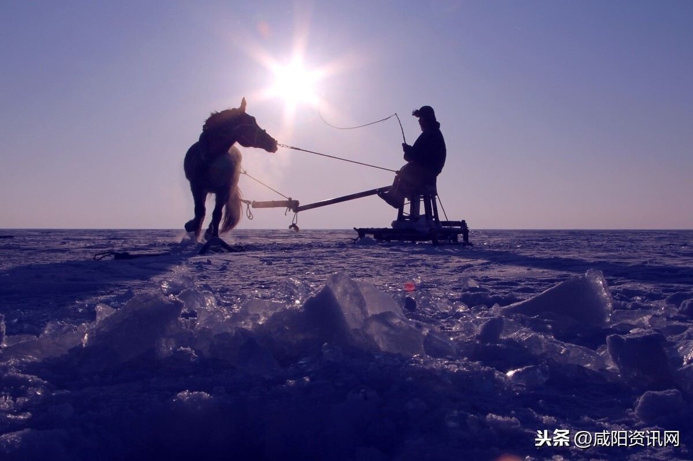

# jilin

吉林省位于中国东北地区中部，北接黑龙江省，南接辽宁省，西邻内蒙古自治区。处于日本、俄罗斯、朝鲜、韩国、蒙古与中国东北部组成的东北亚的腹心地带,东与俄罗斯接壤，东南部以图们江、鸭绿江为界与朝鲜民主主义人民共和国隔江相望。地处东经122-131度，北纬41-46度之间。幅员面积为18.74万平方公里，占全国总面积的2%，东西长750公里，南北宽600公里。边境线全长1384.5公里，其中，中朝边境线长1138.5公里，中俄边境线长246公里。

    2012年全省人口2750.4万，占全国的2.03%。吉林省是多民族省份，有朝鲜族、满族、蒙古族、回族等55个少数民族，人口218.57万，占总人口的7.96%。现辖1个副省级市、7个地级市和延边朝鲜族自治州、长白山管委会，60个县（市、区）。

长春市 changchun 2020-09-01 长春电影制片厂 https://zh.wikipedia.org/wiki/%E9%95%BF%E6%98%A5%E7%94%B5%E5%BD%B1%E5%88%B6%E7%89%87%E5%8E%82

> 伪满国所在地，也是著名的长春电影制片厂所在地，小时候我还参观过长影，记录之。

吉林市 jilin 2020-09-01 雾凇 https://k.sina.cn/article_6332065906_p1796ba87200100r9wk.html?from=travel

> 景点就不去四处寻找了，雾凇确大大有名。

四平市 siping 2020-09-01 火山地质公园 https://www.trip.com/travel-guide/review-attraction/shanmen-scenic-area-80422/87698644/

> 也是东北主战场之一，但是更喜欢中生代火山地质公园这种景色，柱状节理，拽个文。

辽源市 liaoyuan 2020-09-01 寺庙 https://dy.163.com/article/CHMJ50KL0524DF2V.html

> 也挑不出啥著名特色景点来，姑且选择一个市区的宗教寺庙吧。

通化市 tonghua 2020-09-01 高句丽王城 https://zhuanlan.zhihu.com/p/47678444

> 高句丽王城，和金字塔是不能比啊，但是在一个小城市里驻扎着一个王朝的都城，在中国那是比比皆是。

白山市 baishan 2020-09-01 十五道沟 https://www.sohu.com/a/152488438_124024

> 地理位置与朝鲜接壤，自然景观丰富，选择了有东北九寨沟之称的十五道沟，喜欢这种柱状玄武岩。

松原市 songyuan 2020-09-01 查干湖 http://www.9797363.com/view/20191216/28018.html

> 查干湖冬捕，挺有意思。

白城市 baicheng 2020-09-01 向海 https://www.haohua.com/baichengxianhua/info.html

> 莫莫格自然保护区。向海。不知道截图是哪里，越是不发达的地区，自然资源保护的越好，兴安盟和白城给我的感觉就是如此。

延边州 yanbian 2020-09-01 老里克湖 https://k.sina.cn/article_2643734600_p9d94304800100llxw.html

> 老里克湖，有一年去旅游去过一次，不过因为天冷，孩子还小，所以没有走到最里面，以后有机会再去吧。

长白山管委会 changbaishan 2020-09-01 长白山 https://club.huawei.com/thread-12642209-1.html?&extra=page%3D1

> 长白山天池，不用多说了。

