# liaoning

http://www.ln.gov.cn/

辽宁省位于中国东北地区南部。地理位置介于东经118°53′－125°46′，北纬38°43′－43°26′之间，处于温带－暖温带区域并与吉林、内蒙古、河北等省区接壤，东南隔鸭绿江与朝鲜为邻。有汉、满、蒙古、回、朝鲜、锡伯等民族。

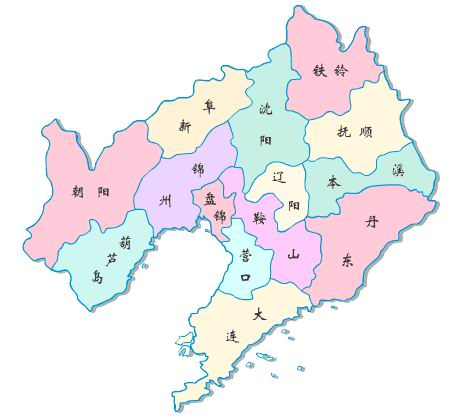

沈阳 shenyang 2020-08-31 沈阳故宫 https://www.twoeggz.com/picture/959266.html

> 全国仅存的两大宫殿建筑群，其一就是沈阳故宫。

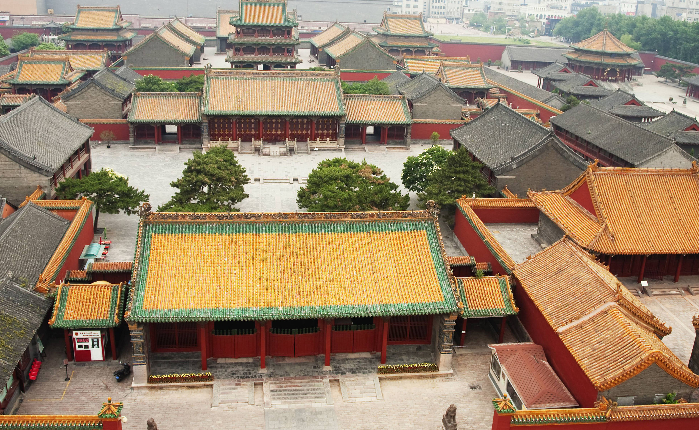

大连 dalian 2020-08-31 渔人码头 https://k.sina.cn/article_2501578225_951b0df104000qrtz.html?from=travel

> 没有去过的城市，俄罗斯风情也蛮多，渔人码头记录之。

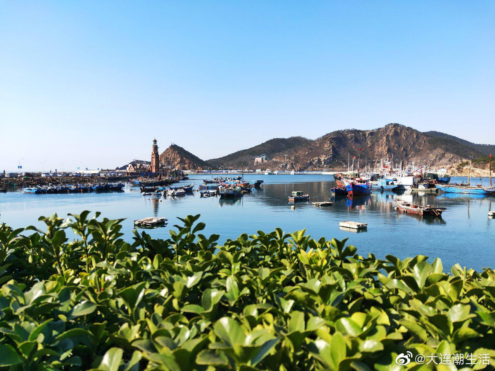

鞍山 anshan 2020-08-31 千山 http://www.dongbeilvyoujingqulianmeng.com/store_12.htm

> 长白山余脉，千山，从图片看，风景确实不错。

抚顺 fushun 2020-08-31 煤矿 http://www.sunny-information.com/thread-33010-1-1.html

> 之前只知道是煤矿产地，没想到这亚洲第一大露天煤矿如此震撼，真是牛。

本溪 benxi 2020-08-31 水洞 https://k.sina.cn/article_1634058407_6165c0a7001001xcr.html?cre=tianyi&mod=wpage&loc=2&r=0&doct=0&rfunc=0&tj=none&tr=98&http=fromhttp

> 又来了一个溶洞，但是名字叫水洞，据介绍地下河流长度最长，值得见识下。

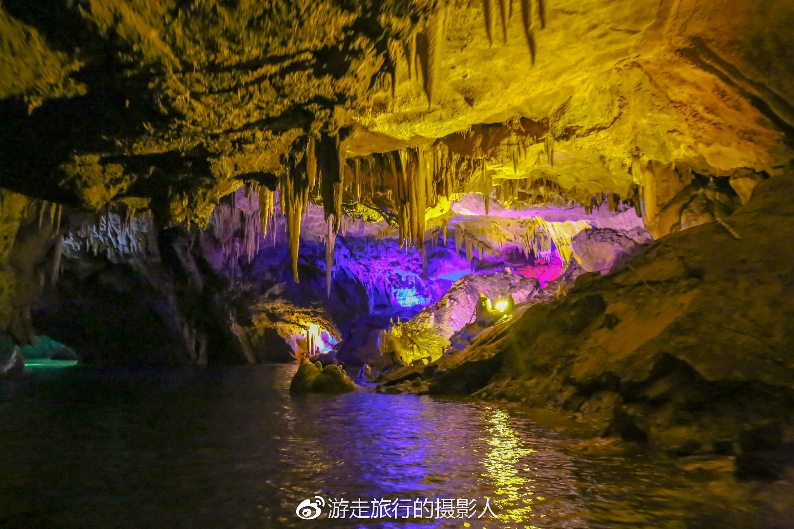

丹东 dandong 2020-08-31 国界线 https://touch.travel.qunar.com/comment/5460375

> 仔细看了看，丹东还是离平壤最近，国界线总是充满了神秘感，有断桥为证。

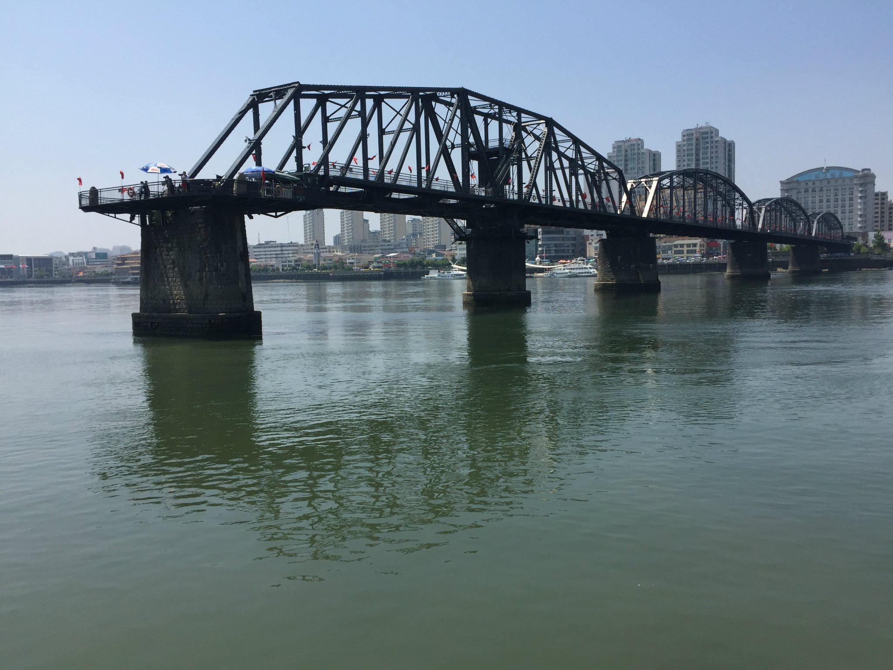

锦州 jinzhou 2020-08-31 奉国寺 http://www.ucxinwen.com/image/426095773959.html

> 辽沈战役核心战场，不过我还是选取了之前不知道的奉国寺作为背景，辽金历史，还是要多多了解。

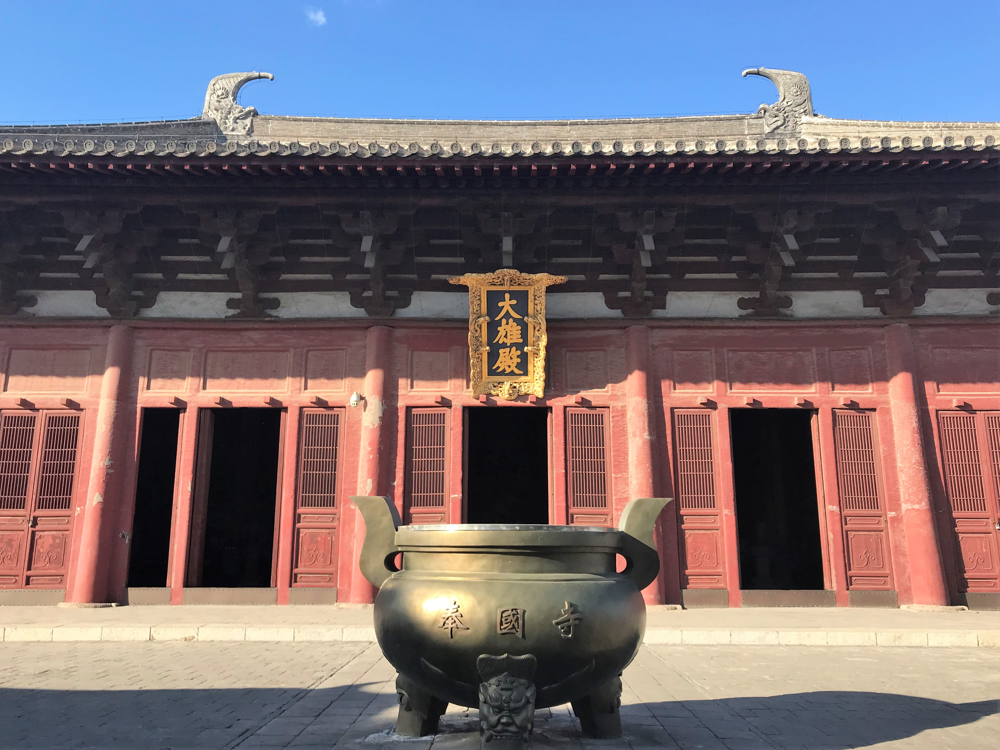

营口 yingkou 2020-08-31 山海广场 https://www.mafengwo.cn/i/12854642.html

> 营口实在没有啥特色啊，唯一的可以看到夕阳落到海平面以下的地级市，望儿山感觉也没啥，那就挑选别人游记里还不错的鲅鱼公主（山海广场）吧。

阜新 fuxin 2020-08-31 瑞应寺 https://touch.travel.qunar.com/comment/5147979?userId=149298977@qunar

> 小布达拉宫——瑞应寺，也太小了，不过阜新景点相对营口还是要丰富上许多的。

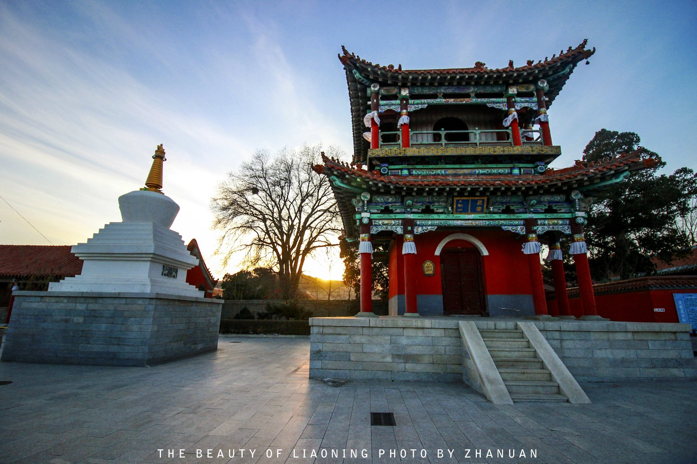

辽阳 liaoyang 2020-08-31 白塔 https://you.autohome.com.cn/details/73538

> 东北真正的历史名城啊，估计众多，截取一张辽阳白塔的近景。

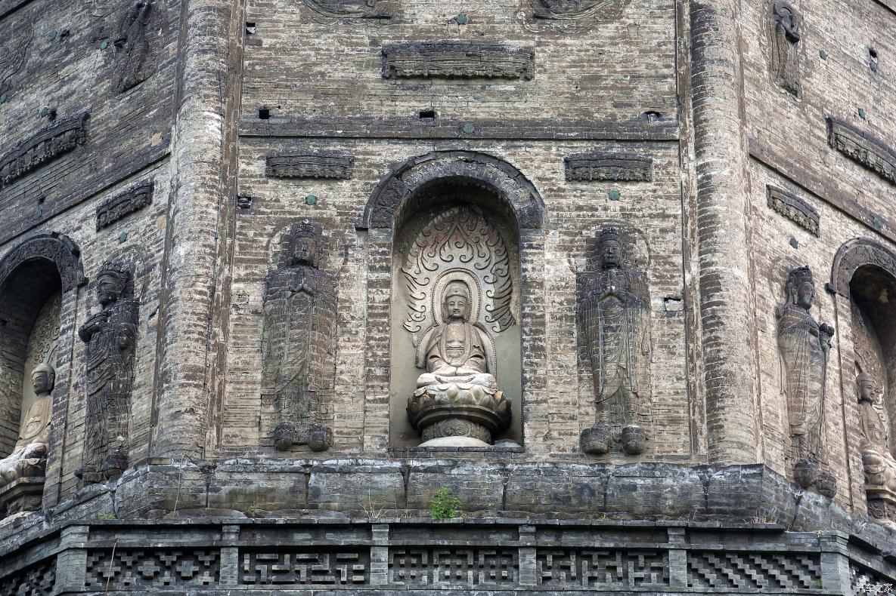

铁岭 tieling 2020-08-31 调兵山 http://www.360doc.com/content/16/1219/19/19083799_616069066.shtml

> 除了赵本山，还有金兀术，调兵山相传是他调遣兵马的地方，这篇摄影博客还不错，详细介绍了调兵山。

朝阳 chaoyang 2020-08-31 大黑山 https://www.sohu.com/a/326620770_99903343

> 快速选取一个，大黑山，天空之境，栈道，玻璃栈道到处有，大黑山这个名字我喜欢。

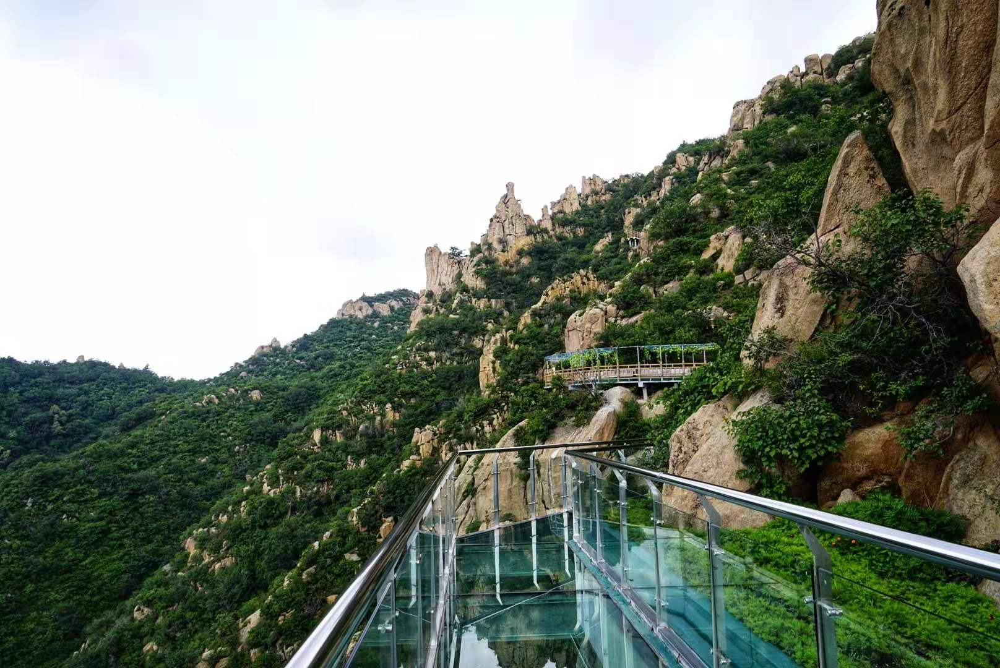

盘锦 panjin 2020-08-31 红海滩 https://travel.qunar.com/travelbook/note/5906857

> 搜索盘锦就出来红海滩，也算是一大特色了。

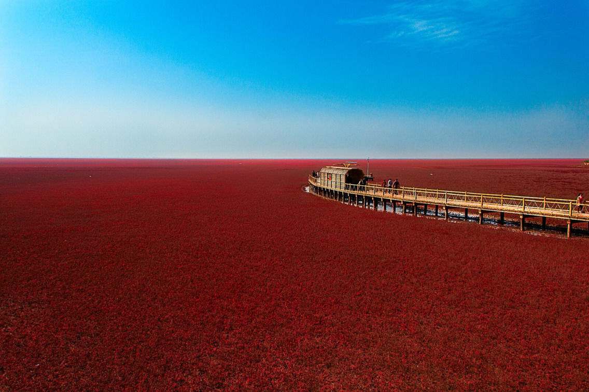

葫芦岛 huludao 2020-08-31 九门口 http://www.stlylt.com/page101

> 葫芦岛，忘不了塔山阻击战。不过，这九门口水上长城也别有一格。

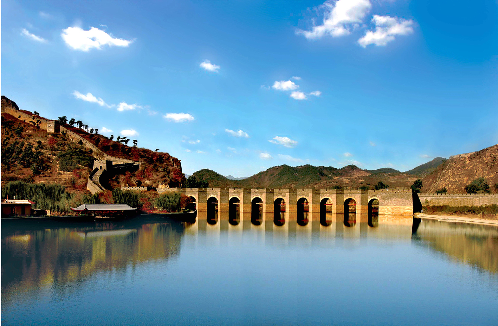