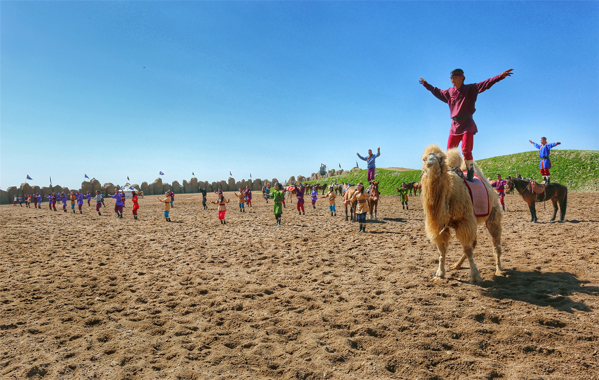
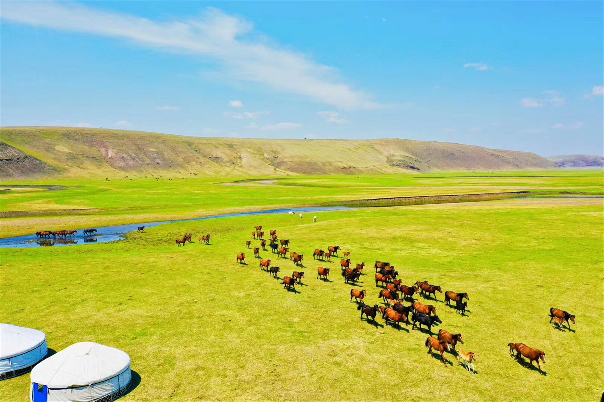
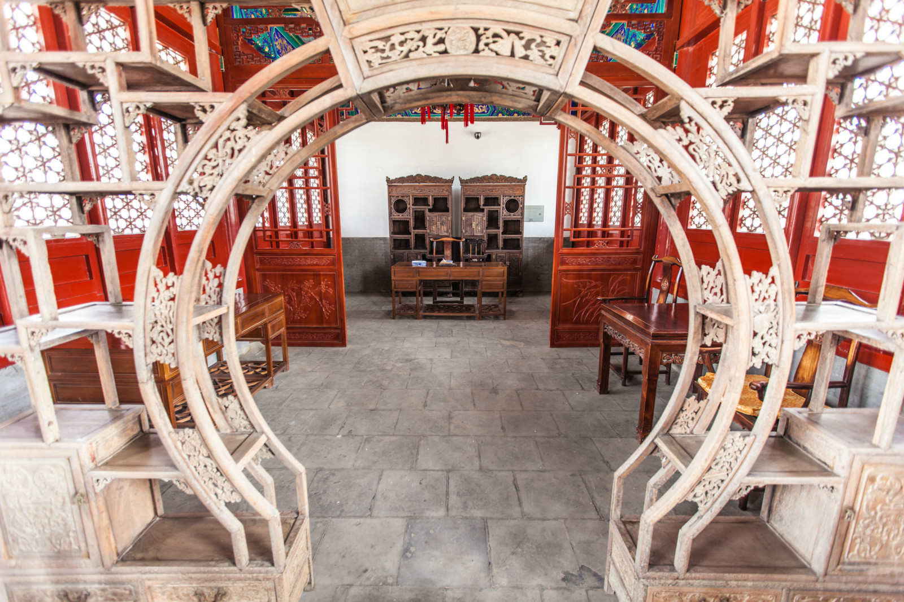
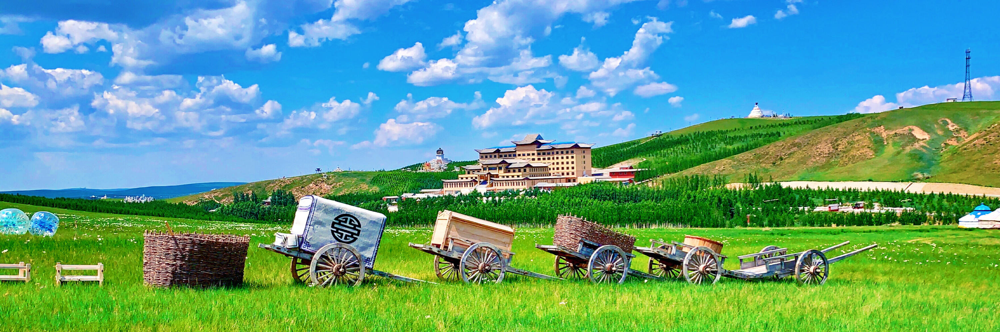
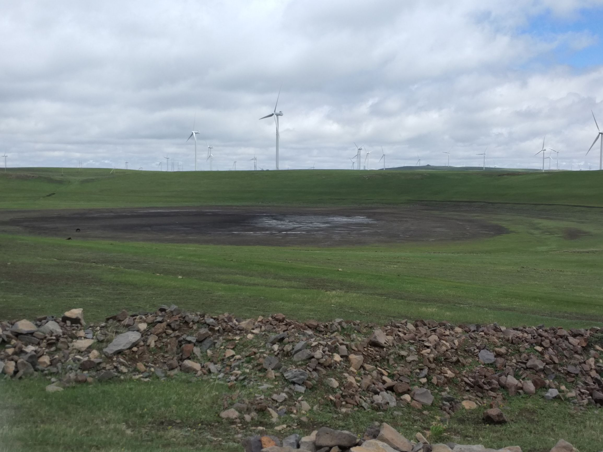
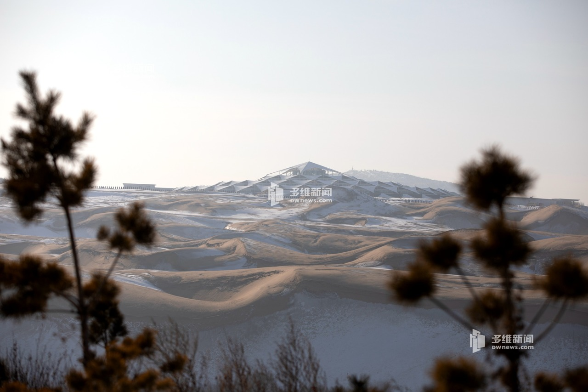
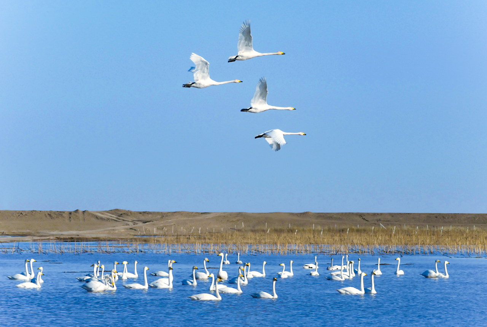
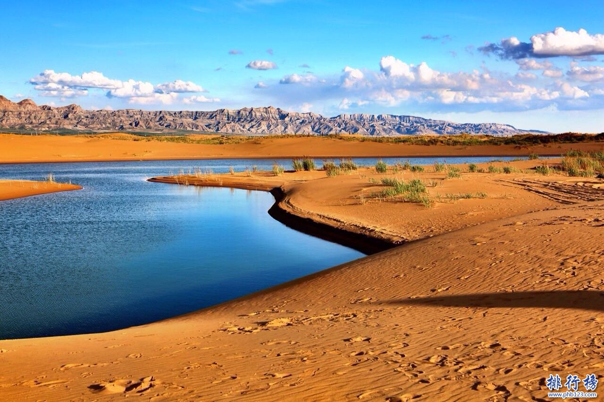
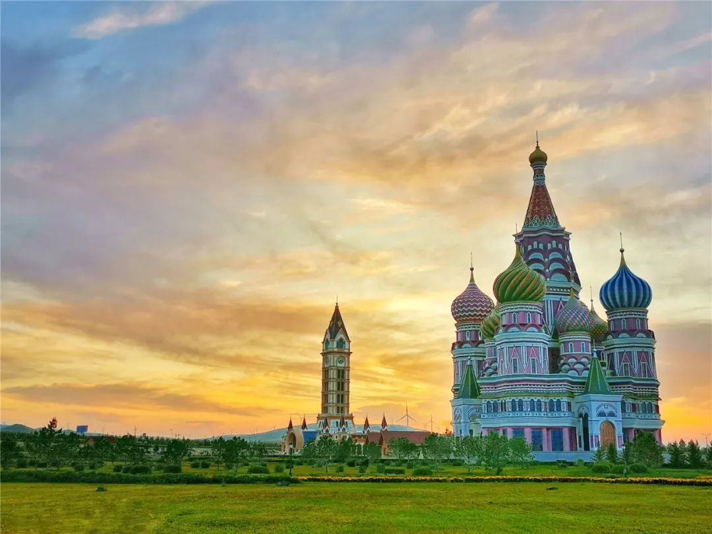
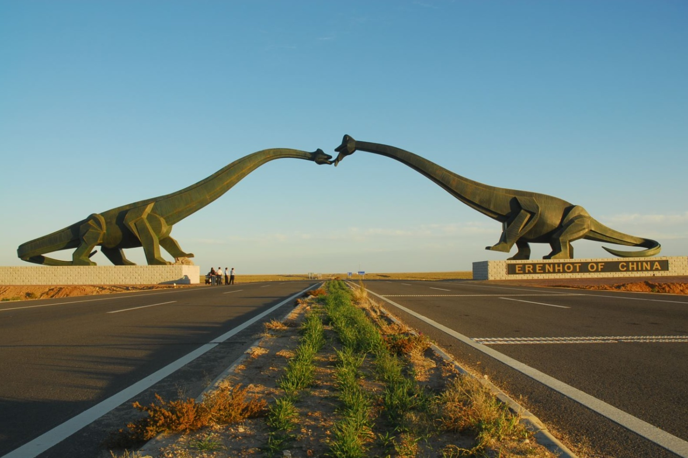

# neimenggu

内蒙古自治区位于中国北部边疆，由东北向西南斜伸，呈狭长形，东西直线距离2400公里，南北跨度1700公里，横跨东北、华北、西北三大区。土地总面积118.3万平方公里，占全国总面积的12.3%，在全国各省、市、自治区中名列第三位。东南西与8省区毗邻，北与蒙古国、俄罗斯接壤，国境线长4200公里。

内蒙古自治区官方网址 http://www.nmg.gov.cn/

呼和浩特 http://www.huhhot.gov.cn
http://bbs.lvye.cn/thread-2623038-1-1.html

> 呼和浩特，景点多，但知名的好像不多，选取一个三星景点，五塔寺。

包头 http://www.baotou.gov.cn
https://www.fliggy.com/content/d-210150062981?ttid=seo.000000576&seoType=origi

> 希拉穆仁大草原，内蒙古怎么能没有草原和蒙古包。哈哈

呼伦贝尔 http://www.hlbe.gov.cn
https://travel.qunar.com/travelbook/note/7505285

> 我怎么忘了，论草原，有谁能比得上呼伦贝尔大草原！！！

兴安盟 http://www.xam.gov.cn
http://www.aoyou.com/news/n11649/

> 没想到这里的天池也很美，驼峰岭天池位于阿尔山。酷，中国的风景也挺美啊。

通辽 http://www.tongliao.gov.cn
https://travel.sohu.com/20160713/n458959801.shtml

> 草原景色也有，但是我更感兴趣的是孝庄这个名字，于是收录孝庄园文化旅游区。

赤峰 http://www.chifeng.gov.cn
http://www.mafengwo.cn/poi/24850.html

> 草原就不记录了，将军泡子，据说是古战场，马蜂窝的评论笑哭了。

锡林郭勒盟 http://www.xlgl.gov.cn
http://www.mafengwo.cn/i/14752794.html

> 这个城市布局很方正，看别人的游记还不错，风景挺美。

乌兰察布 http://www.wulanchabu.gov.cn
https://www.sohu.com/a/85505247_439998

> 黄花沟，草原上的火山，看了不少游记，内蒙景点宰客都比较严重。这点要注意。

鄂尔多斯 http://www.ordos.gov.cn
https://www.popyard.com/cgi-mod/newspage.cgi?num=6576844&r=1%3E%3E%3E%3E%3E%3E%3E%3E%3E%3E%3E%3E%3E%3E%3E

> 鄂尔多斯，印象中除了羊毛衫就是那鬼城的名头了，截取一处沙漠中的五星级酒店作为桌面。

巴彦淖尔 http://www.bynr.gov.cn
http://www.zgcsb.com/zhuanti/2019-09/25/content_125934.html

> 河套地区，本来想选取大坝沟岩画的，实在没有好图，突然发现有个乌梁素海，草原地区的湖泊，截一个。

乌海 http://www.wuhai.gov.cn
http://m.wumaow.org/paihang/36287.html

> 本以为乌梁素海已经不错了，又来了个城市名就以湖为名的，乌海，旁边就是沙漠，奇特。

阿拉善盟 http://www.als.gov.cn
http://travel.sina.com.cn/domestic/pages/2018-10-19/detail-ifxeuwws6004122.shtml

> 阿拉善除了有英雄会，还有这么美的胡杨林，一定得去看看，得找个秋天。

满洲里 http://www.manzhouli.gov.cn
https://zhuanlan.zhihu.com/p/157610212

> 呼伦贝尔代管的市，一直以为是在东北，其实是在内蒙，三国交界的地方，套娃广场很有特点，浓浓俄罗斯风情。

二连浩特 http://www.elht.gov.cn
https://zhuanlan.zhihu.com/p/131282792

> 这个地方和外公居然还有一点渊源，还是恐龙之乡，那就找一只，哦，不两只恐龙作为背景吧。

内蒙古之旅结束。
