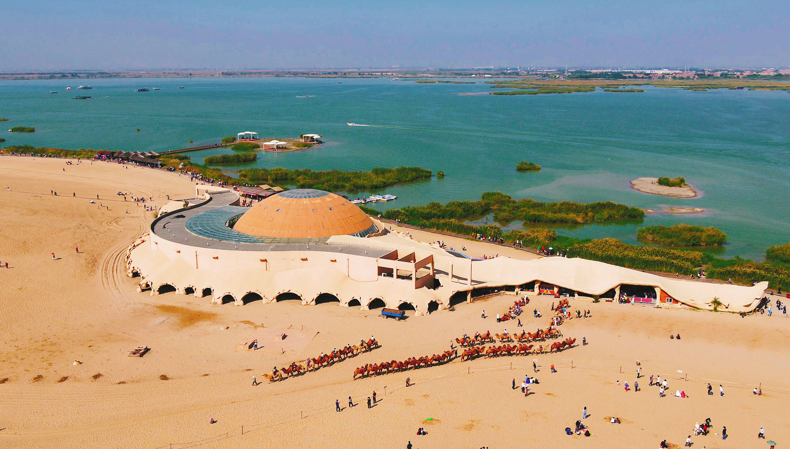
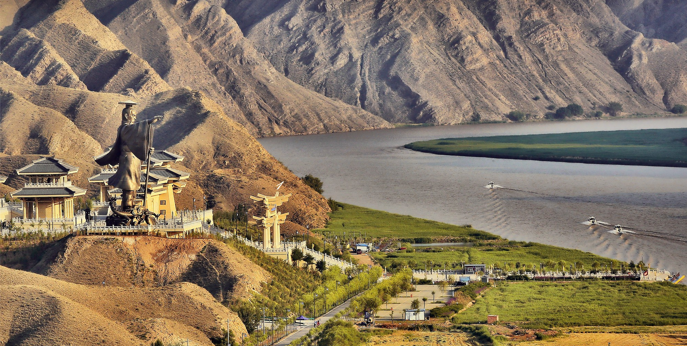
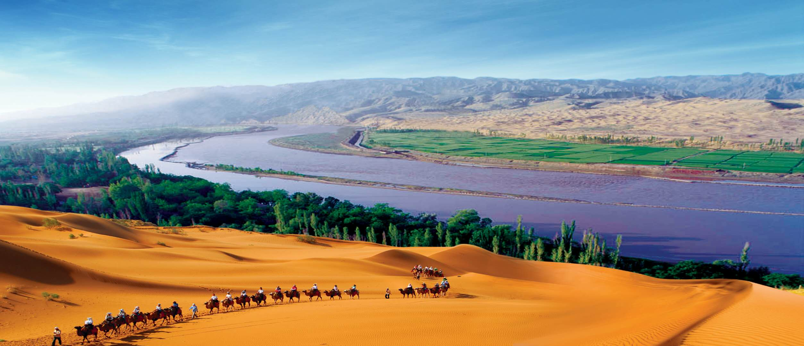
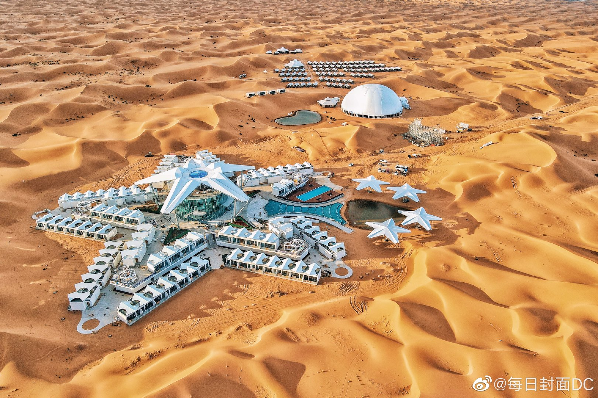

# ningxia

https://www.nx.gov.cn/

宁夏是中华民族远古文明发祥地之一。境内灵武市“水洞沟遗址”表明，早在3万年前的旧石器时代，就有人类在此生息繁衍。公元前3世纪，秦始皇统一六国后， 在此设北地郡，派兵屯垦，兴修水利，开创了引黄灌溉的历史。公元1038年，党项族首领李元昊以宁夏为中心，建立大夏国，故元代以后史称西夏，定都兴庆府 （今银川市），形成了和宋、辽、金政权三足鼎立189年的局面。元灭西夏后，设宁夏路，始有宁夏之名。明朝设宁夏卫，清代设宁夏府。1929年成 立宁夏省。新中国成立后，1954年宁夏省撤销并入甘肃。1958年10月25日成立宁夏回族自治区。

源自：http://m.fangjiaapp.com/news/884.html

银川市 yinchuan 2022-12-25 西夏王陵 https://bbs.dji.com/thread-192747-1-1.html

>西夏统治300余年，立国不到200年。也算是留有浓重的一笔了，西夏王陵是现存地面占地最大的王陵，是了解西夏历史不可或缺的一地。

石嘴山市 shizuishan 2023-01-05 沙湖 https://www.sohu.com/a/475842451_351047

> 很巧，马上要去宁夏游玩，对这里的景点特别留意了一下，沙湖，曾被评为我国十大航拍地标之一。沙漠和湖水同框出现。

吴忠市 wuzhong 2023-01-06 青铜峡大峡谷 https://k.sina.com.cn/article_2989040942_pb229252e00100nzni.html?from=travel#p=16

> 黄河上游最后一道十余公里长的峡谷，旁立有大禹造像，还有108座塔，等边三角形。

固原市 guyuan 2023-01-06 火石寨 http://www.nxnews.net/zt/2020/2020nxlc/2020mlnx/202003/t20200323_6644479.html

https://rmh.pdnews.cn/Pc/ArtInfoApi/article?id=9604570

> 国家地质公园，火石寨。七彩丹霞。两座山峰之间的栈桥挺吓人啊。须弥山石窟的大佛据说大小仅次于乐山大佛，比龙门石窟还大啊。

中卫市 zhongwei 2023-01-06 沙坡头 https://www.sohu.com/a/386339457_114988

https://www.thepaper.cn/newsDetail_forward_10951068

> 独特的景观，沙漠、黄河、高山、绿洲，集于一处，还有那沙漠中的孤独的星星酒店，还没去就想去。

