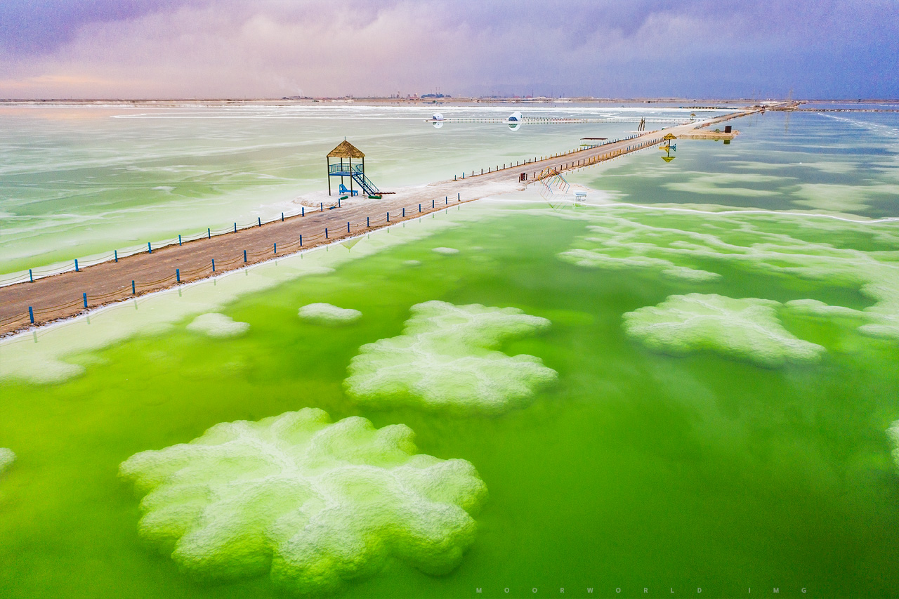

# qinghai

http://www.qinghai.gov.cn/

青海省位于祖国西部，雄踞世界屋脊青藏高原的东北部。因境内有国内最大的内陆咸水湖——青海湖而得名，简称“青”。青海是长江、黄河、澜沧江的发源地，故被称为“江河源头”，又称“三江源”，素有“中华水塔”之美誉。 青海省地理位置介于东经89°24′3″至103°4′10″，北纬31°36′2″至39°12′45″，东西长度为1240.6千米，南北长度为844.5千米。全省总面积为72.23万平方千米，占全国总面积的十三分之一，面积排在新疆、西藏、内蒙古之后，列全国各省、市、自治区的第四位。青海北部和东部同甘肃省相接，西北部与新疆维吾尔自治区相邻，南部和西南部与西藏自治区毗连，东南部与四川省接壤。

源自：https://www.fangjiaapp.com/news/880.html

西宁市 xining 2022-11-05 拉脊山 https://menghsuan37.pixnet.net/blog/post/223851854

> 上次闹了个笑话，将西宁和南宁搞混了。丢人，简直是丢人。所以这次挑选地方不敢进城了，选了西宁往青海湖的一个必经之路——拉脊山，也因为这个名字也挺搞笑的。据说景色不错，可惜人们往往只知道青海湖，而忽略了路途中的美景。且大家都说拉脊山是黄土高原和青藏高原的分界线。

海东市 haidong 2022-11-13 瞿昙寺 https://www.ccmapp.cn/news/detail?id=151f1d62-9528-4600-ba46-b5d7396b6b9d&categoryid=&categoryname=%E6%9C%80%E6%96%B0%E8%B5%84%E8%AE%AF

> 西北小故宫之称，汉藏结合的寺院。已完成了数字化壁画

海南州 hainan 2022-11-15 龙羊湖 https://touch.travel.qunar.com/comment/10160660321

> 本来找了个日月山，和日月潭挺般配，后来发现好像搞了乌龙。日月山是西宁下面的县的，于是看了地图上还有一个龙羊湖。原来黄河也可以是碧蓝碧蓝的。

海北州 haibei 2022-11-16 金银滩 https://m.thepaper.cn/newsDetail_forward_17629082

> 海北，金银滩，也是我国第一个核武器试验场所在地，221厂，第一机密，有些事连在那里工作的人都不知道。30多年从地图上消失。

海西州 haixi 2022-12-06 察尔汗盐湖 http://moorworld.com/?p=11719

> 这个盐湖没有茶卡盐湖有名，主要是不是白色的，够不上天空之境。但是看起来绿色也挺不错的，而且这个盐湖比茶卡那个要大很多倍。而且估计人也不会很多。

 

黄南州

果洛州

玉树州

