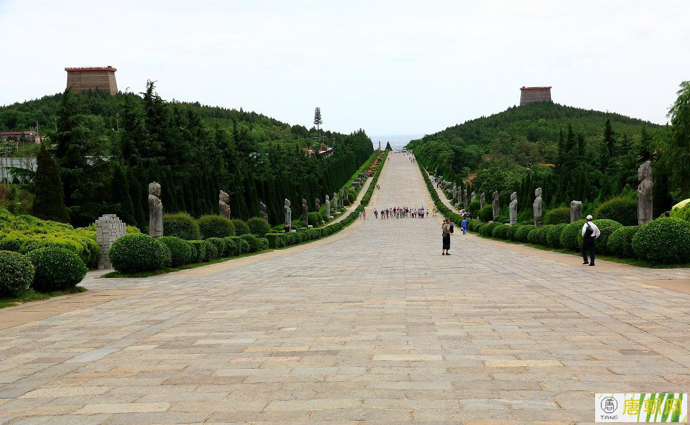

# shaanxi

www.shaanxi.gov.cn

陕西省简称“陕”或“秦”，位于中国内陆腹地，黄河中游，地处东经105°29′～111°15′,北纬31°42′～39°35′之间。东邻山西、河南，西连宁夏、甘肃，南抵四川、重庆、湖北，北接内蒙，居于连接中国东、中部地区和西北、西南的重要位置。我国大地原点就在陕西省泾阳县永乐镇。

全省地域南北长、东西窄，南北长约870公里，东西宽200至500公里。

全省以秦岭为界南北河流分属长江水系和黄河水系。主要有渭河、泾河、洛河、无定河和汉江、丹江、嘉陵江等。

全省土地面积为20.58万平方公里。

图片来源：https://www.fangjiaapp.com/news/698.html

西安市 xian 2022-05-12 兵马俑 http://www.029.cyou/m/view.php?aid=3408

> 兵马俑不用多说了吧，发现了快50年了。被视为世界第八大奇迹。

宝鸡市 baoji 2022-05-12 太白山 http://www.mafengwo.cn/travel-scenic-spot/mafengwo/14369.html

> 中国内陆最高的森林公园，3500多米。不过查资料的时候发现2021年6月的时候发生过一起旅游车翻车事故，有些不淡定了。这种情况目前为止我还没怎么遇到过。去不去到时候看情况吧。

咸阳市 xianyang 2022-05-29 乾陵 http://www.ymgushi.com/wuzetian/194.html

> 咸阳，秦唐古都，乾陵，又是以一代女皇武则天而闻名，未遭大规模开挖，比较完整，六十一番臣无头石像和无字碑留下了千古谜团。

铜川市 tongchuan 2022-06-05 药王山 http://m.cnwest.com/sxxw/a/2022/01/06/20218103.html

> 铜川，西安和延安之间的必经之道，药王孙思邈的故乡，药王山便是当地纪念他所建，孙思邈的医术和医德的确甚高。农历每年的二月初二还有药王庙会。

渭南市

延安市

榆林市

汉中市

安康市

商洛市

杨凌示范区

