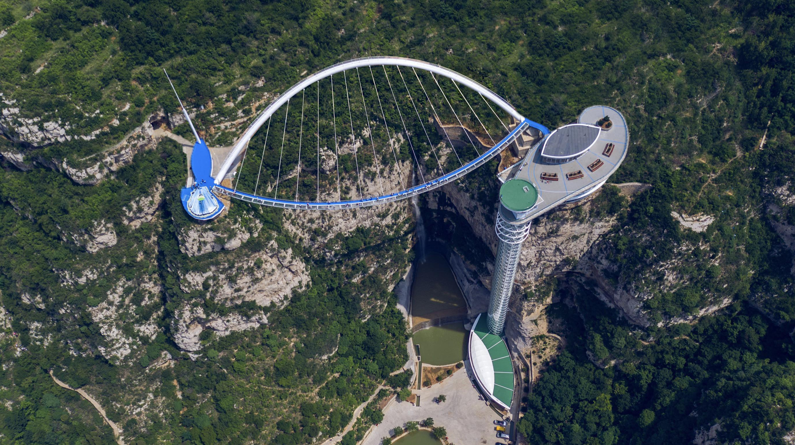

# shandong

http://www.sd.gov.cn/

山东省位于中国东部沿海、黄河下游，北纬34°22.9′—38°24.01′、东经114°47.5′—122°42.3′之间。境域包括半岛和内陆两部分，山东半岛突出于渤海、黄海之中，同辽东半岛遥相对峙；内陆部分自北而南与河北、河南、安徽、江苏4省接壤。全境南北最长约420多公里，东西最宽约700多公里，总面积15.71万平方公里，约占全国总面积的1.64%。

http://news.bandao.cn/a/381400.html

济南市 https://kuaibao.qq.com/s/20191121A07R7Z00?refer=spider

> 济南的春天，济南最有名的估计就是这御笔钦赐的天下第一泉了，趵突泉。还有大明湖畔的夏雨荷，哈哈。

青岛市 https://m.qqlyjt.com/article/fzxmPUaVU.html

> 看了一圈，奥帆中心，花石楼，最后还是落了俗套，选择了名气更响的自然景观——崂山。

淄博市 https://www.fulvxing.com/piao/detail/offerid/1237.html

> 淄博有古车马，有蒲松龄，但是这些后造的人文景观都有点假了，还是现代加自然结合的潭溪山更吸引我去探访。

枣庄市 http://leshuiyou.cn/portal/newsup/franchise-detail?id=6dc14f44f68011e7953400163e03575d

> 台儿庄在枣庄，不过大半毁于战争时期，微山湖也在枣庄，铁道游击队应该也在枣庄。微山湖其实挺大，著名的红荷风景区挺漂亮。

东营市 https://k.sina.cn/article_7022558148_p1a293bbc400100le5v.html?from=travel

> 黄河，中华母亲河，孙武，兵圣。黄河入海口的黄蓝奇观真是叹为观止，不过应该难得一见。

烟台市 https://k.sina.cn/article_2643734600_p9d94304800100lxul.html

> 蓬莱阁名声更响一点，但是都是人造景观估计，八仙名气也不小。可以去涨涨见识，熟悉熟悉神话知识，不过有着小马尔代夫之称的养马岛，水好清啊。

潍坊市 https://www.mafengwo.cn/i/12499538.html

> 潍坊的风筝全国知名，但是我找到一处北方园林，十笏园，也算别有风味，颇有苏州园林的味道。

济宁市 https://www.atec.com.hk/2018/03/26/5a%E6%99%AF%E5%8D%80-%E5%B1%B1%E6%9D%B1%E6%BF%9F%E5%AF%A7%E5%B8%82%E6%9B%B2%E9%98%9C%E6%98%8E%E6%95%85%E5%9F%8E/

> 济宁有曲阜，中国有孔子，2000年的文化传承始于此，曲阜孔庙就是中国传统文化的实物代表。

泰安市 https://travel.qunar.com/travelbook/note/7574841

> 不得不提中华政治文化的象征——泰山，山不在高，名气大极了。

威海市 https://www.sohu.com/a/313090921_119016

> 西霞口 成山头 好运角，北京以南最东面，离韩国最近的景区。总总称呼，是我对威海这一处的印象。不过威海还有有关秦始皇的庙宇，以及甲午海战的博物馆值得一去。

日照市 http://www.lvmama.com/lvyou/photo/d-rizhaohaibinguojiasenlingongyuan160579.html

> 海边有沙滩，还有森林？对，日照海滨森林公园就是这么个地方，让我想起了LOST。日照确实是个好地方。

临沂市 http://ymstm.com/recArticle/getList4

> 银座，中国居然有个景点叫银座。沂蒙山很有名，居然就在离江苏挨着的临沂市，不错。

德州市 https://m.ctrip.com/webapp/you/tripshoot/paipai/detail/detail?articleId=6109146&seo=0&from=https%3A%2F%2Fgs.ctrip.com%2Fhtml5%2Fyou%2Fsight%2Fqingyun2890%2F135334.html%3Fseo%3D1

> 德州扒鸡，每每路过德州，总能听到熟悉的叫卖声。德州的旅游资源没有特别多，千年枣树，太阳谷什么的挑不出好图片，选择一个海导金山寺作为典型吧。

聊城市

滨州市

菏泽市