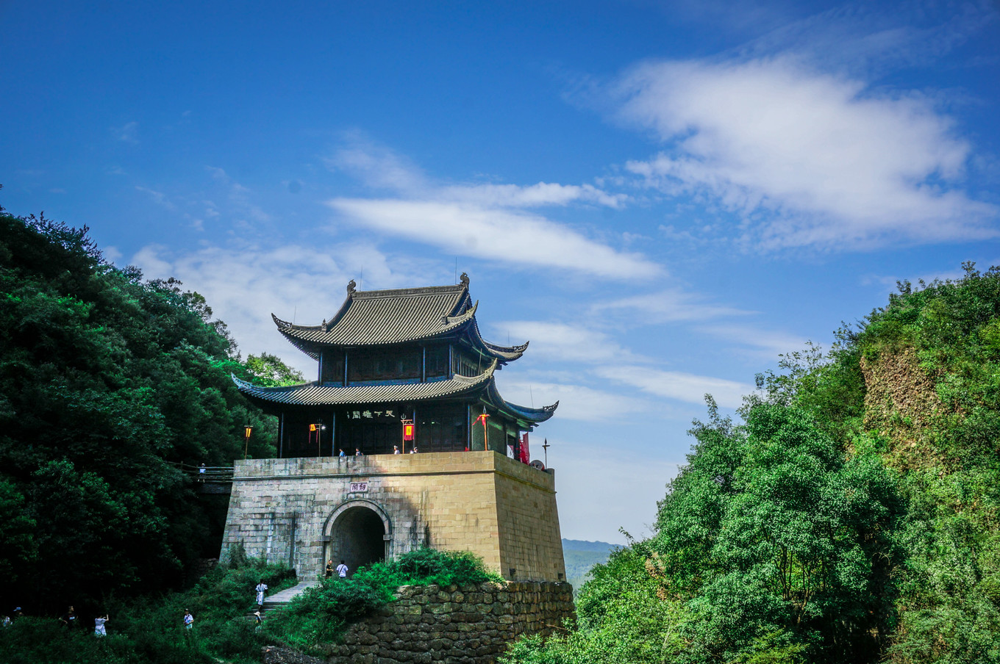

# sichuan

http://www.sc.gov.cn/

四川简称川或蜀，位于中国西南部，地处长江上游，素有“天府之国”的美誉。全省面积48.6万平方公里，辖21个市（州）、183个县（市、区），与重庆、贵州、云南、西藏、青海、甘肃和陕西等7省（自治区、直辖市）接壤，有全国最大的彝族聚居区、第二大藏区和唯一的羌族聚居区。2019年末全省户籍人口9099.5万人、常住人口8375万人，其中少数民族人口599.4万人。

成都 chengdu 2021-01-28 都江堰 https://www.sohu.com/a/299370293_100160517

> 都江堰，成都下辖县级市，抛开成都那么多景点，我选择了都江堰，自然是对这座千年工程情有独钟。值得去几次。

自贡 zigong 2021-01-29 自贡世界地质公园 https://3g.163.com/news/article/FV6FG7SQ05378PIV.html

> 自贡是以恐龙闻名天下的，也具有很典型的地质地貌，恐龙博物馆就在这个地质公园内。

攀枝花 panzhihua 2021-02-02 二滩国家森林公园 https://new.qq.com/omn/20180424/20180424A1W88M.html

> 一看世界第三高坝还挺激动，原来四川还有第一高坝，高坝也成为一个专题了。攀枝花是著名的能源产地，水电站资源也挺丰富，一道开胃小菜已经上起。

泸州 luzhou 2021-02-03 老窖池 https://www.xuehua.us/a/5ebb3ef986ec4d48b7d4f311?lang=zh-tw

> 泸州后面一定跟着老窖两个字，作为酒文化大国，杜康、茅台、泸州老窖家喻户晓，来这里可以体验下酒香和酒文化。

德阳 deyang 2021-02-17 三星堆 https://kuaibao.qq.com/s/20200222A0FWTN00?refer=spider

> 三星堆古遗址，谜一样的存在，中华文明历史远没有那么悠久。这地方还被谣传是外星人的遗址。

绵阳 mianyang 2021-02-19 罗浮山 http://www.lfswq.com/

> 地壳运动的神奇，产生了这么一座山，喀斯特地貌，有全景浏览，线上资源丰富。

广元 guangyuan 2021-03-08 剑门关 https://kuaibao.qq.com/s/20190721A0DBBO00?refer=spider

> 四川的门户，天下第一雄关，剑门关。后建的关楼看起来好小，看图片还不是很明显，还是得去亲身体验一下才知道到底有多险。

遂宁 suining 2021-03-24 灵泉寺 https://hk.trip.com/travel-guide/suining/holy-water-temple-10543736/

> 相传遂宁是观音的故乡，这塔也挺壮观。据说遂宁还有一个中国死海，也可以去玩玩。

内江 neijiang 2021-05-04 圣水寺 https://kuaibao.qq.com/s/20190714A0J4K100?refer=spider

> 内江第一佛寺，历史悠久，即时如此，古迹保留亦十分困难，名气不响的古迹尤其如此，洞穴壁画石雕风化严重，加之战乱影响，几乎不存。

乐山 leshan 2021-05-05 乐山大佛 https://aerial.scol.com.cn/tp/201904/56860807.html

> 围绕乐山大佛的传说特别多，有什么四次眼流泪说，有洗脚说，乐山大佛前面就是岷江。又是有生之年系列。

南充 nanchong 2021-05-15 阆中古城 http://travel.qunar.com/travelbook/smartlist/7426521

> 阆中古城，不知道为什么号称四大古城之一，不过说到名字还是有一些似曾相识的感觉的，阆中还曾经是川蜀的中心。

宜宾 yibin 2021-05-30 蜀南竹海 https://www.inbar.int/cn/%E5%90%B9%E5%93%8D%E5%85%A8%E5%B8%82%E7%AB%B9%E4%BA%A7%E4%B8%9A%E5%8F%91%E5%B1%95%E9%9B%86%E7%BB%93%E5%8F%B7-%E5%AE%9C%E5%AE%BE%E5%B8%82%E7%AB%B9%E4%BA%A7%E4%B8%9A%E5%8F%91%E5%B1%95/

> 宜宾，既有五粮液，又有悬棺，悬棺的确很神奇和神秘，放棺材照片有点瘆人，还是放弃了，挑选了赏心悦目的竹海。宜宾宜兴，傻傻分不清楚。

广安 guangan 2021-05-31 宝箴寨 http://scnongye.scol.com.cn/web/detail.aspx?id=5607

> 广安，总设计师的故乡，还有有着攻不破之称的蜀中堡垒——宝箴寨。

达州 dazhou 2021-06-01 巴山大峡谷 https://www.sohu.com/a/455702662_100221749

> 之前忽视了，百科里是分文保和自然景观两部分的，巴山大峡谷看起来是一个山川景观，目前4A，在争取5A景点的名号。看来这个不太出名的地方，还是有不错的自然景观的。

巴中 bazhong 2021-06-01 光雾山 https://k.sina.cn/article_2215328174_840b39ae00100vkbd.html?from=travel

> 巴中革命景点很多，不过还是挑选了光雾山，夏绿秋红，10月份也是值得一去的地方。

雅安 yaan 2021-06-02 碧峰峡 https://www.gushiciku.cn/dl/0gmoP/zh-tw

> 曾经去过碧峰峡大熊猫养殖基地，感觉景色还是不错的，没想到还有其他好玩的地方。也曾经驶过雅安高速，开了100-200公里，不同的季节去感受应该是大不一样的。

眉山 meishan 2021-06-08 三苏祠 https://k.sina.cn/article_6434949964_17f8d8b4c00100olw4.html

> 酒香也怕巷子深，距离成都只有80km远的苏家三父子，成就知名度不亚于杜甫。另外峨眉山是乐山下属的县级市，眉山是挨着成都的地级市，别搞混了。

资阳 ziyang 2021-06-12 安岳石刻 https://k.sina.cn/article_1729029873_670ee6f1001002y3f.html

> 安岳周围的群山上，有着十万余尊摩崖石刻，石刻造型的确很有特色，水月观音，又有东方维纳斯之称。

阿坝 aba 2021-06-15 卓克基土司官寨 http://www.cdsouth.com/sichuan-history/9034.html

> 中国最后一位土司的官寨，毛泽东长征北上的过程中还曾在此住宿一周，并对土司有了新的认识。整栋建筑是穿斗式，未用一钉一铆。

甘孜 ganzi 2021-06-15 丹巴古碉群 https://www.nanmuxuan.com/zh-tw/leisure/fxwuwpjlila.html

> 藏族特色村落，号称最美村落，看了下民宿的评价也不错，上不了高原，在这高原脚下欣赏也不错啊。据说女儿国也是以此地的东女国为原型的。

凉山 liangshan 2021-06-16 泸沽湖 https://www.xuehua.us/a/5eb560c286ec4d3dbca7be51?lang=zh-hk

> 大凉山，选秀节目里经常能听到来自大凉山的歌声。上次自驾游，我最远就到了泸沽镇，但是一看地图，泸沽镇离着泸沽湖还有250公里以上，西部大世界啊。一度产生回忆重叠，感觉好像去过西昌卫星发射中心，甚至带两娃买过纪念品，但是实际上又没有去过，好像买纪念品的事情又发生在宜昌三峡大坝那里。

