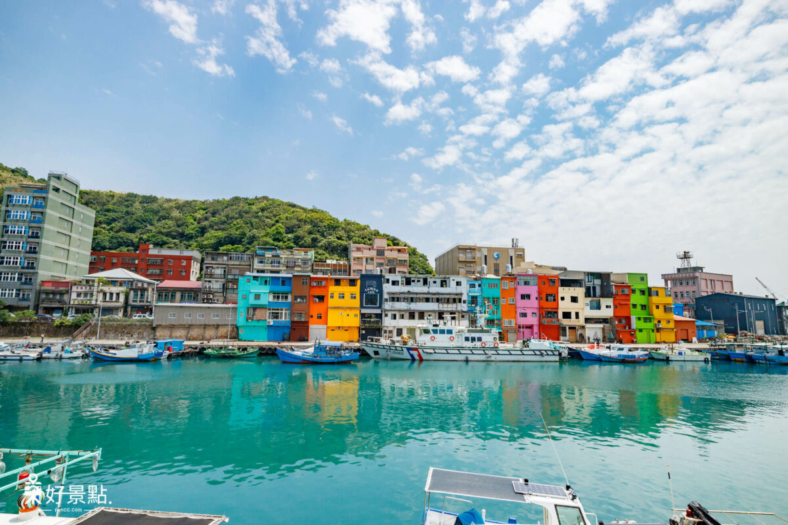
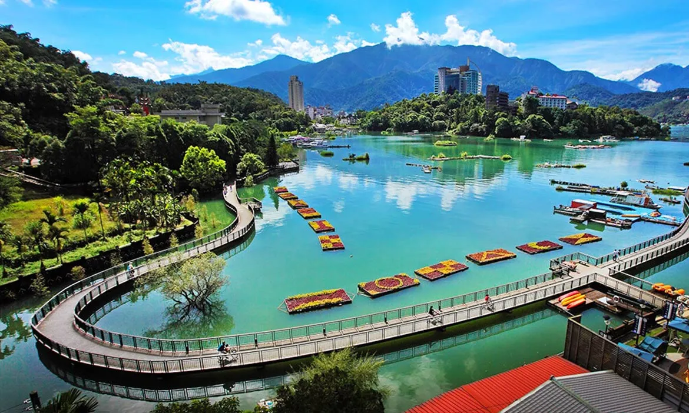
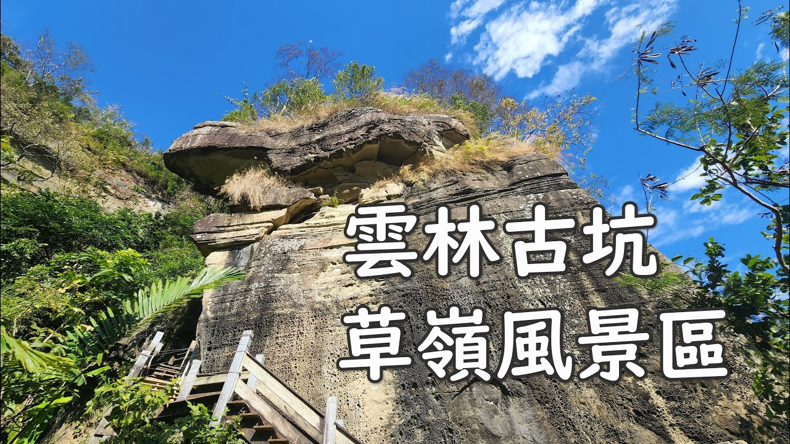
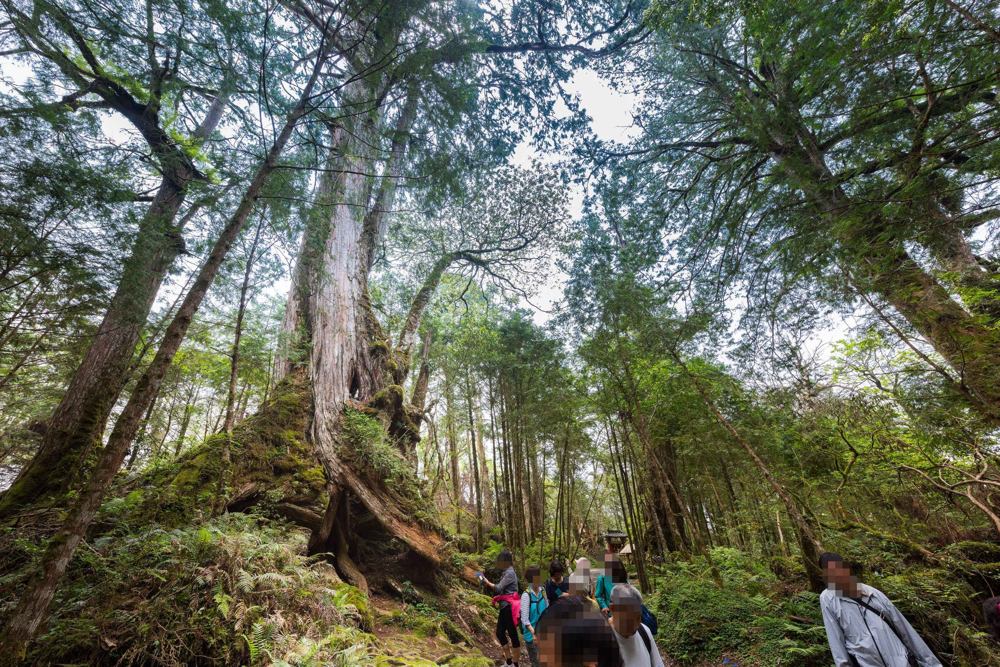
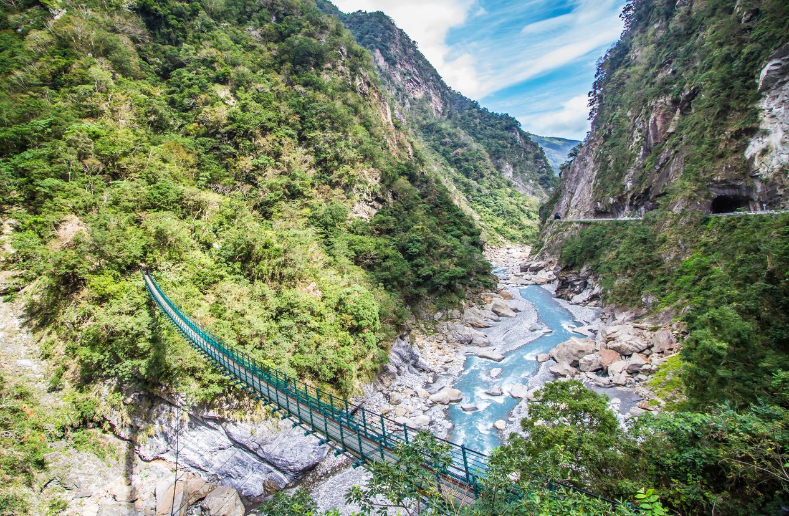
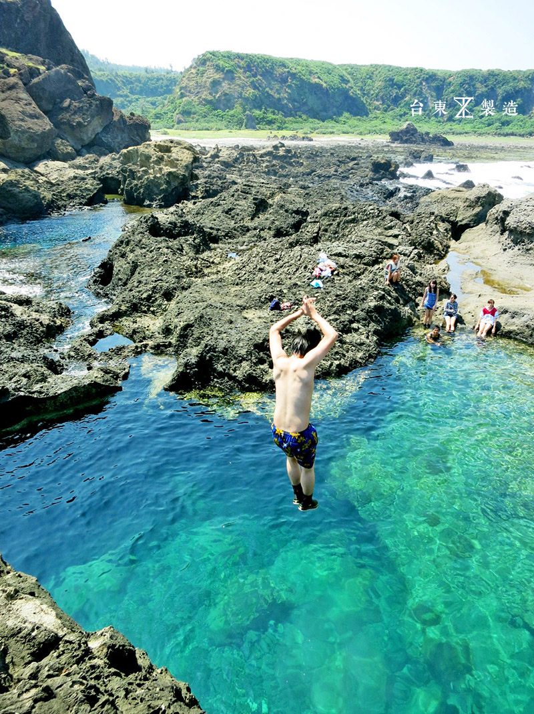
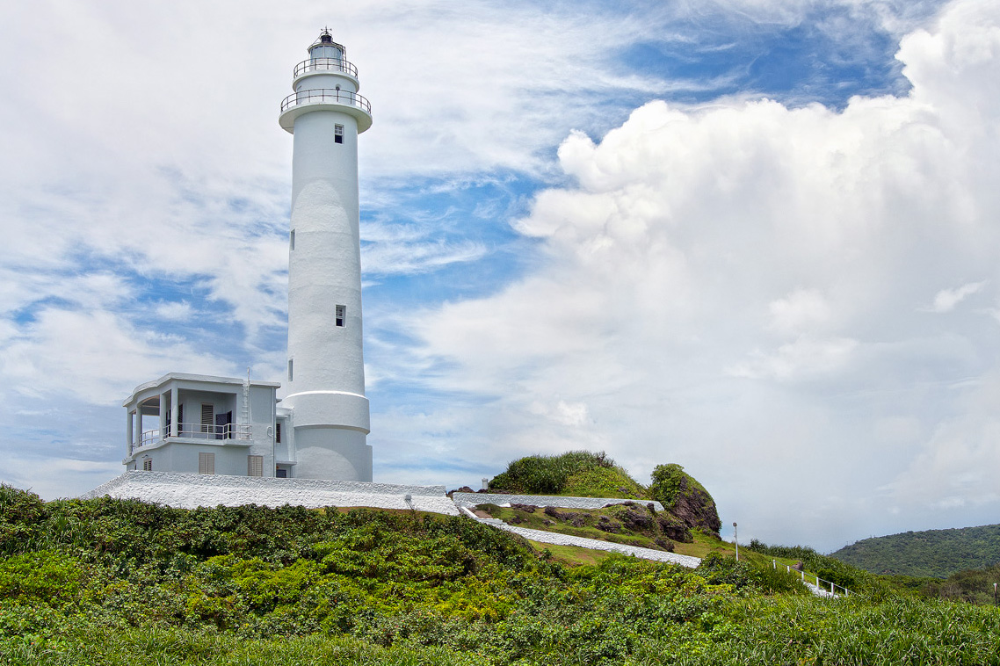
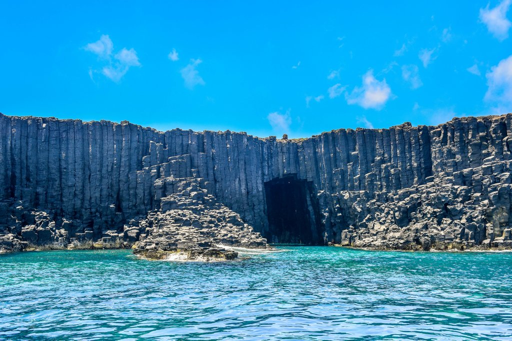

# taiwan

台湾自古就是中国神圣领土不可分割的一部分。1949年以来，由于中国内战延续和外部势力干涉，海峡两岸陷入长期政治对立的状态。尽管台湾与祖国大陆尚未统一，但中国主权和领土从未分割，两岸同属于一个中国的事实从未改变。

源自：https://www.sohu.com/a/574369657_100023059

台北市 taibei 2023-05-01 台北故宫博物院 https://nchdb.boch.gov.tw/assets/overview/culturalLandscape/20220526000001

> 看图片，地方不是很大的样子，藏品大多来自70多年前的北京故宫，有生之年要去看看系列。

新北市 xinbei 2023-05-01 野柳地质公园 https://cloud.culture.tw/frontsite/inquiry/actFestivelAction.do?method=doDetailActFestivel&actId=542

> 看起来造型奇特的石头，突出进海洋的地质公园，奇想联翩。

桃园市 taoyuan 2023-05-02 草漯沙丘 https://www.ntdtv.com.tw/b5/20211008/video/306216.html?%E6%8E%A2%E7%B4%A2%E5%8F%B0%E7%89%88%E6%92%92%E5%93%88%E6%8B%89%E6%B2%99%E6%BC%A0%20%E8%B5%B0%E8%A8%AA%E8%8D%89%E6%BC%AF%E6%B2%99%E4%B8%98%E5%9C%B0%E6%99%AF%E5%B1%95%E7%A4%BA%E9%A4%A8

> 感觉地方小，没什么磅礴的景观，只是一些沿海地质公园类。海边的沙子多到形成沙丘，也算是一个小特色了。

台中市 taizhong 2023-05-03 武陵农场 https://blog.owlting.com/2019/01/14/nuandonghuadabaolawulinghuajijiaotongguanzhihuagonglue/

> 樱花盛开总是很美

台南市 tainan 2023-06-13 七股盐山 https://lorrin3021mw.pixnet.net/blog/post/460622609-%E5%AF%93%E6%95%99%E6%96%BC%E6%A8%82%E7%9A%84%E8%A6%AA%E5%AD%90%E5%A5%BD%E5%8E%BB%E8%99%95%E3%80%82%E5%8F%B0%E5%8D%97%E5%B8%82%E4%B8%83%E8%82%A1%E5%8D%80%E4%B8%83%E8%82%A1%E9%B9%BD

> 感觉有很多的人文景观，建筑、老房子、博物馆什么的，自然景观都比较小巧，盐山这个虽然也很小巧，对我也算一个新奇吧。

高雄市 gaoxiong 2023-06-18 西子湾 https://touch.travel.qunar.com/comment/4758851

> 壮阔的海景，号称台湾八景之一。对于高雄名称的由来其实有学习到。日本人占领了50年，的确改变了不少。还有地下隧道群等等，打狗博物馆等等。

基隆市 jilong 2023-06-19 正滨渔港 https://foncc.com/archives/15855

> 其实简简单单涂个乱七八糟的颜色，亮丽的颜色，景色就起来了。这就是我看完这个打卡点的感受，模仿威尼斯彩色岛的风格，就是规模小了点。

新竹市 xinzhu 2023-07-09 都城隍庙 https://www.sundaytour.com.tw/zh-tw/attractions/detail.php?pid=7642

> 全台级别最高的城隍庙，每年农历七月初一会有盛大的仪式。小吃一条街也不错。

嘉义市 jiayi 2023-07-11 二二八纪念碑 https://zh.wikipedia.org/zh-tw/%E5%98%89%E7%BE%A9%E5%B8%82%E4%BA%8C%E4%BA%8C%E5%85%AB%E7%B4%80%E5%BF%B5%E5%85%AC%E5%9C%92%E4%BA%8C%E4%BA%8C%E5%85%AB%E7%B4%80%E5%BF%B5%E7%A2%91

> 台湾绕不过的二二八事件，嘉义是事件发生的主要地点，不知道再过个几十年，当时的人都不在了会怎么样。

新竹县 xinzhuxian 2023-07-09 The One南园人文客栈 https://udn.com/news/story/7266/6903417

> 颇有江南水乡的特色，看戏、品茗一天包食宿还真不便宜。每天的访客还有限额。不过查了下，不是新竹市，是新竹县。

苗栗县 miaoli 2023-07-12 白沙屯拱天宫 https://newtalk.tw/news/view/2020-02-27/373165

> 海边的妈祖，宗教信仰，苗栗国。台湾北部还是中部的城市？已经不那么重要了。

彰化县 zhanghua 2023-07-12 大佛风景区 https://zh.wikipedia.org/zh-cn/%E5%BD%B0%E5%8C%96%E7%B8%A3

> 台湾的东西感觉都是小小的，这个大佛也是。彰化是台湾人口最多的县级行政区。

南投县 nantou 2023-07-15 日月潭 https://smiletaiwan.cw.com.tw/article/2426

> 日月潭的知名度毋庸置疑。

云林县 yunlin 2023-07-15 草岭风景区 https://www.youtube.com/watch?v=f0tHR0jFPuw

> 水帘洞，峭壁雄风，好多各色各样的步道，还是很不错的自然风景。

嘉义县 jiayixian 2023-07-11 阿里山 https://taiwanhot.net/news/983156/%E5%BD%B1%EF%BC%8F%E9%98%BF%E9%87%8C%E5%B1%B1%E9%9A%99%E9%A0%82%E6%97%A5%E8%90%BD+%E7%B8%AE%E6%99%82%E6%86%BE%E6%94%9D%E8%A7%80%E9%9B%B2%E7%80%91

> 原来阿里山和日月潭不在一个地方，看来我对这块土地了解的也太少了啊。

屏东县 pingdong 2023-07-18 垦丁国家公园 https://zh.wikipedia.org/zh-cn/%E5%A2%BE%E4%B8%81%E5%9C%8B%E5%AE%B6%E5%85%AC%E5%9C%92

> 之前亲戚姐姐去玩的时候好像听说去过这里，果然是宝岛最南端的海滩。可以玩的地方还挺多的。

宜兰县 yilan 2023-07-26 马告神木园 https://makauy.lealeahotel.com/

> 排名靠前的照片果然还是官网的，只是这也有点偷懒，通过遮罩的形式去掉了下面的游客。还号称亚洲最大神木园？真有那么大吗？神木园位于岛的中部，有些造型奇特的大树。

花莲县 hualian 2023-07-26 太鲁阁国家公园 https://www.arukikata.co.jp/web/directory/item/105518/

> 台湾东部山林比较多，看地图玉山国家公园比较明显，不过太鲁阁这个名字比较容易让人有好感，所以我就选这个啦。花莲县的人口是比较少的，旅游人数已经远远超过了。

台东县 taidong 2023-08-26 绿岛乡 https://www.zztaitung.com/6557/green-island

> 岛外有岛，绿岛虽然和大堡礁有点名字上的纠葛，但是作为很有特色的小岛，四分之三的土地保有原生态，物资靠大岛采购，还是很好玩的，景点都没有名字。据说在大岛的滨海公园还可以隐约看见。

台东县 taidong 2023-07-28 绿岛 https://www.tsta-bj.com/Article.aspx?sNo=04005635

> 台湾是宝岛，台湾的离岛也很精彩。绿岛和澳洲的绿岛有点撞名。有机场15分钟即可抵达。海洋景色很明显。勾起了我想去深海岛屿的心。

澎湖县 penghu 2023-08-26 蓝洞 https://www.taiwanviptravel.com/penghu/

> 某旅行社的页面，也算系统的从吃住玩几个方面了解了澎湖好的地方。很想知道，海岛上的人每天跟海在一起，也会过腻了吗？

金门 jinmen 2023-09-04 建功屿 https://grace5228blog.com/blog/post/jiangong-island

> 这些地方不知道什么时候可以去参观游览一番。小小的屿，退潮与涨潮时差别还是非常大的，因为错过时间而被困在屿上的事情还是非常容易发生的，也太好笑了。这四个巨型人塑也很有地方产业特色。

建功屿还有一个实时4k的频道，这个也很有意思啊。 https://www.youtube.com/watch?v=uh_yNAE01w8

马祖 mazu
