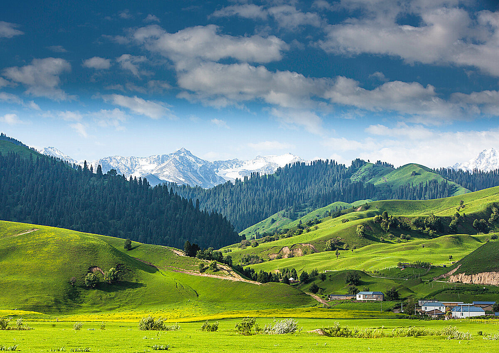
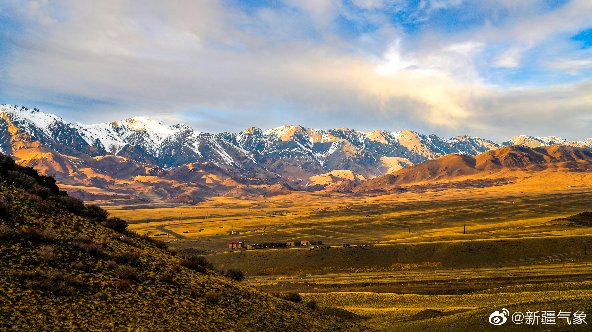

# xinjiang

http://www.xinjiang.gov.cn/

新疆古称西域，自古以来就是祖国不可分割的一部分。公元前138年，汉武帝派张骞出使西域，西汉政权与西域各城邦建立了联系。公元前60年，西汉政权在乌垒（今轮台县境内）设立西域都护府，自此西域正式列入汉朝版图。清乾隆后期改称西域为新疆，1884年正式建立新疆省，省会迪化（今乌鲁木齐市）。1949年新疆和平解放，1955年10月1日成立新疆维吾尔自治区，首府设在乌鲁木齐市（蒙古语意为优美的牧场）。

源自：https://www.bbthy.net/life/2276.html

乌鲁木齐市 wulumuqi 2023-01-30 大巴扎 https://vacation.eztravel.com.tw/sight/plc0000081938/international-bazaar-%E5%9C%8B%E9%9A%9B%E5%A4%A7%E5%B7%B4%E6%89%8E

> 很多年前去过一次，这里的确是对新疆了解的一个典型窗口。印象最深的还是里面卖的绿色的帽子，汉人非常避讳，维族人没有这种避讳，还有很多编织精美的地毯。

伊犁哈萨克自治州 yili 2023-02-20 那拉提 https://www.mafengwo.cn/gonglve/ziyouxing/406185.html

> 对新疆的认知还停留在沙漠，其实新疆的美还是挺震慑的。远不止荒凉那种。山清水秀，大美新疆。

塔城地区 tacheng 2023-02-20 巴尔鲁克山 https://rmh.pdnews.cn/Pc/ArtInfoApi/image?id=32171184

> 苍茫的原野，辽阔的雪山

阿勒泰地区 aletai 2023-02-20 禾木村 https://www.youtube.com/watch?v=OvcCXHK9xMI

> 秋日童话，边陲小村。仿如经典油画。

克拉玛依市 kelamayi 2023-02-26 魔鬼城 https://k.sina.cn/article_1929590785_p7303380102701313n.html?from=photo

> 这个地方不想多说。魔鬼城，不是有多恐怖，而是指这里的风口像鬼哭狼嚎。

博尔塔拉蒙古自治州 boertala 2023-03-02 赛里木湖 https://500px.com/search?q=%E8%B5%9B%E9%87%8C%E6%9C%A8%E6%B9%96&type=photos

> 大西洋最后一滴泪水，海拔2000多米的高原湖泊，蓝冰，收费景点。是美。从500px下载一张图片，其他精美的图片都要获取版权，还是不随便粘贴了。

昌吉回族自治州 changji 2023-03-25 天山天池 http://www.xinjiangyou.cn/raiders/show_1.html

> 昌吉行政区划很奇怪，整个自治州分成两段，中间是乌鲁木齐。天山天池又在东侧的阜康市。天池又称瑶池。其实现在看来没那么遥远。

哈密市 hami 2023-03-25 魔鬼城 https://tw.trip.com/travel-guide/attraction/hami/hami-monster-city-82499/

> 雅丹地貌的魔鬼城，在新疆真是到处都是的感觉。不知道西非大沙漠是不是也是如此。哈密的魔鬼城没有景交，都得自驾前往，也是很期待。哈密瓜不知道是不是这里的特产？

吐鲁番市 tulufan 2023-03-26 火焰山 https://baike.baidu.com/tashuo/browse/content?id=62556134269bac4116010ebc

> 恕我肤浅了，直接跳过其他历史古迹，跳过葡萄，直奔西游记相关主题——火焰山。据说这里夏天真的很热，晚上都睡屋顶，看满天繁星，也的确勾起夏天去玩玩的心。这景点据说还有一个描述西游记和火焰山的地宫。

巴音郭楞蒙古自治州 bayinguoleng 2023-03-26 楼兰古城 https://www.hk01.com/藝文中國/562526/歷史探秘-不破樓蘭終不還-唐詩中的西域古國為何湮滅

> 号称最贵景区，还是因为人迹罕至，至今去过的人不到5w，只有三间破房的遗址，还有破旧的佛塔遗址。其他啥都没有。估计最鼎盛的时期也没太多人。顶多一个小县城的规模。不过有了楼兰美女的加持，和诗人不破楼兰终不还的加持，成为想象中的matrix。

阿克苏地区 akesu 2023-03-26 天山神秘大峡谷 https://k.sina.com.cn/article_7480117239_1bdd987f700100waol.html

> 这红色的山，才真是火焰山啊。可以进入内部，恍如火星，虽然也并没有去过火星。

克孜勒苏柯尔克孜自治州 kezile 2023-03-27 天门 https://www.sohu.com/a/619344669_121608709

> 其实我国的最西端，不是喀什，而是克州。

喀什地区

和田地区

以及11个自治区直辖县级市

