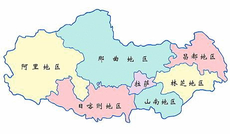
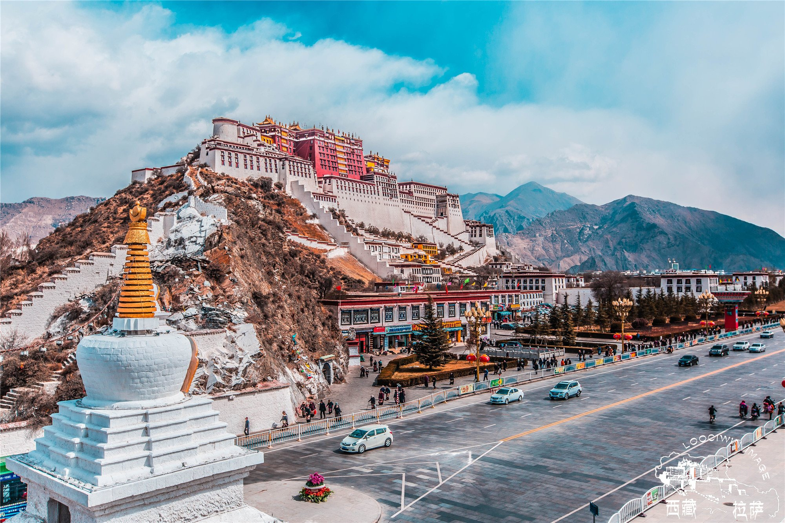
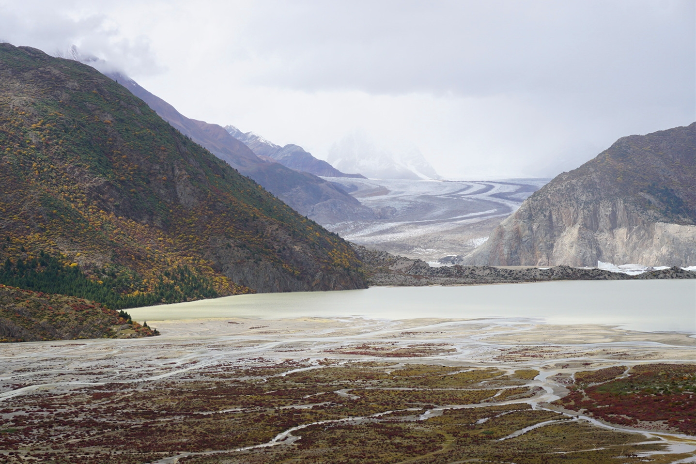
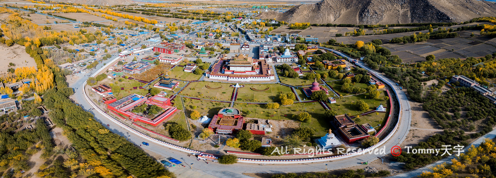
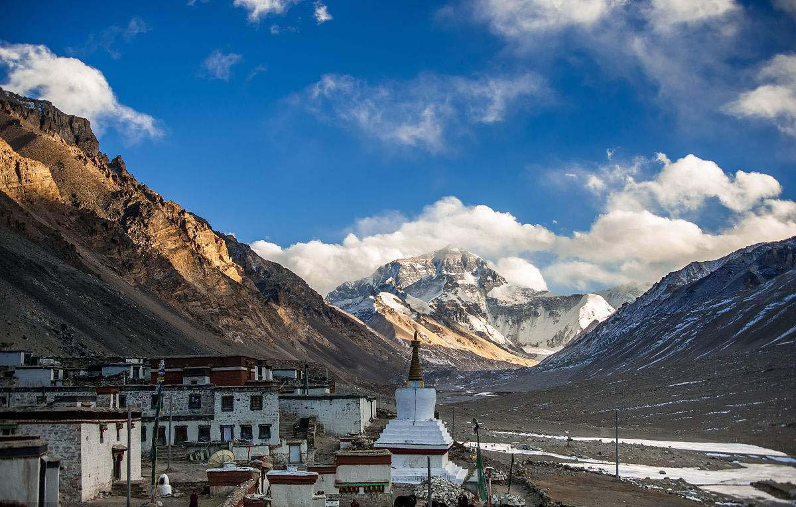
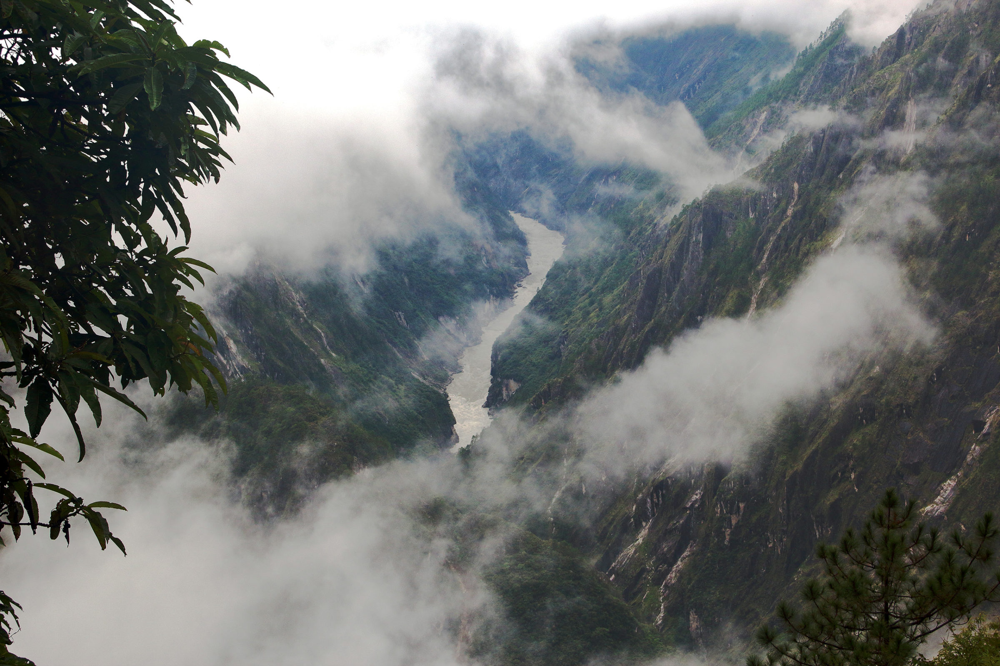

# 西藏

https://www.xizang.gov.cn/

西藏自治区位于青藏高原西南部,地处北纬26°52′至36°32′,东经78°24′至99°06′之间的广大地区｡北邻新疆,东连四川,东北紧靠青海,东南连接云南,南与缅甸､印度､不丹､尼泊尔等国毗邻,西与克什米尔地区接壤,地势由西北向东南倾斜,地形复杂多样,国境线长4000余千米,南北最宽900多千米,东西最长2000多千米,是我国西南边陲的重要门户和屏障｡全区面积120多万平方千米,约占全国总面积的1/8,在全国各省(自治区､直辖市)中仅次于新疆｡

拉萨市 lasa 2022-03-16 布达拉宫 https://travel.qunar.com/p-cs299809-lasa

> 毋庸置疑，提到拉萨，除了文成公主，布达拉宫不做第二想。拉萨整体海拔还算相对偏低的，如果是飞机的话，应该准备点药物就够了。

昌都市 changdu 2022-04-26 然乌湖 http://www.mafengwo.cn/i/8869634.html

> 本来想找个神山的图片，实在找不到，碰巧找到一篇骑行游记，很赞。80天6000km，昌都的然乌湖被作者重点标记了，景色果然很美。

山南市 shannan 2022-04-26 桑耶寺 https://k.sina.com.cn/article_2192556155_p82afc07b02700jpae.html#p=2

> 西藏第一寺，佛法僧俱全，又别称“三样寺”，相传是西藏第一座寺院，低调的震撼。

日喀则市 rikaze 2022-04-27 珠穆朗玛 https://www.sohu.com/a/164821091_393286

> 这辈子不可能登顶了，能去珠峰北大营近距离看看也是不错的体验。绒布寺南面一点的营地，去海拔最高邮局寄一封明信片回去也是不错。

林芝市 linzhi 2022-04-27 雅鲁藏布大峡谷 https://chinadialogue.net/zh/6/73477/

> 林芝的海拔落差还是挺大的，雅鲁藏布大峡谷最后一片净土，如果哪天建成国家公园了，非常一定要去。

那曲市

阿里地区行政公署