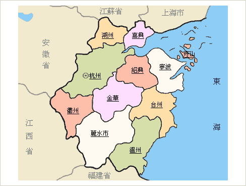
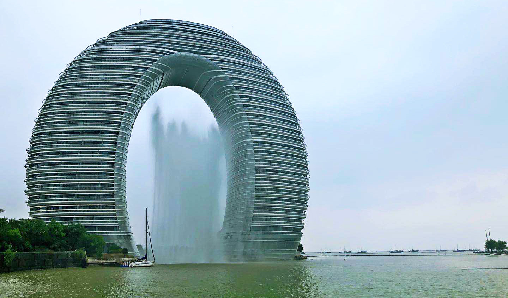
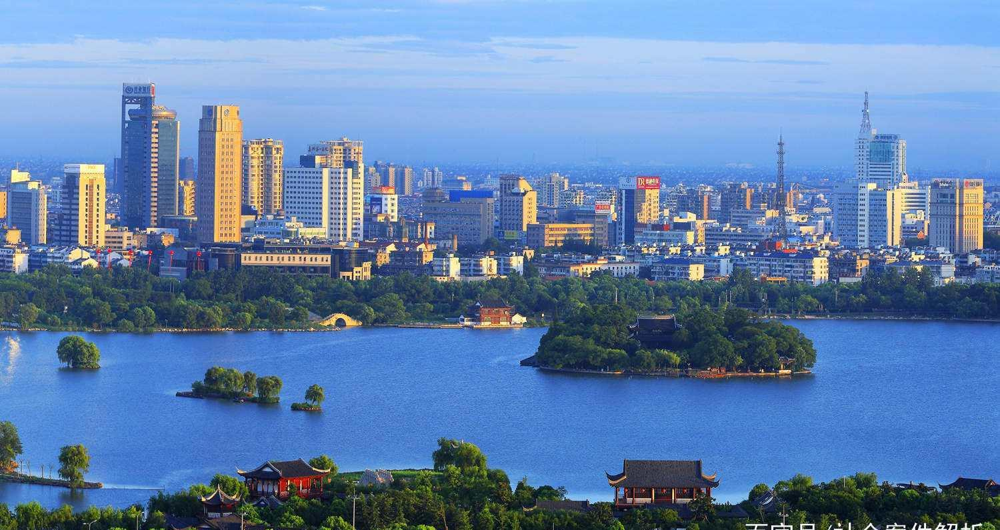
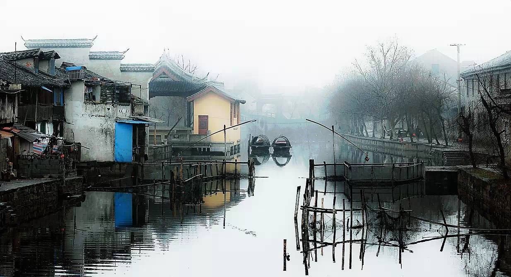
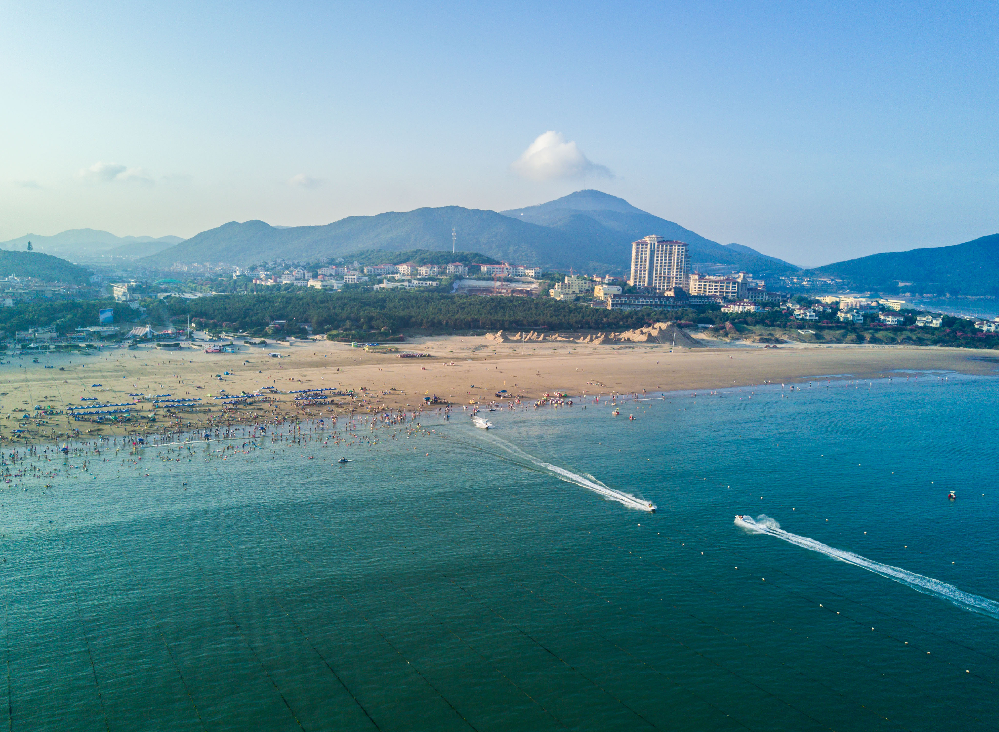

# zhejiang

http://www.zj.gov.cn/

浙江省地处中国东南沿海长江三角洲南翼，东临东海，南接福建，西与江西、安徽相连，北与上海、江苏接壤。境内最大的河流钱塘江，因江流曲折，称之江，又称浙江，省以江名，简称"浙"。省会杭州。浙江省东西和南北的直线距离均为450公里左右，陆域面积10.18万平方公里，为全国的1.06%，是中国面积最小的省份之一。全省有杭州市、宁波市等2个副省级城市，温州、湖州、嘉兴、绍兴、金华、衢州、舟山、台州、丽水等9个地级市。全省下设36个县、22个县级市和32个市属城区。2012年末全省常住人口5477万人。

杭州市 hangzhou 2020-09-05 西湖 http://www.win4000.com/wallpaper_detail_151020_4.html

> 西湖就不用多说了，没有选一些著名的景，挑了一个顺眼的。

宁波市 ningbo 2020-09-05 天一阁

> 天一阁，很有文化韵味的地方。亚洲最古老的图书馆。

温州市 wenzhou 2020-09-05 雁荡山 http://www.oct-cts.com/Travel/Route/412.html

> 温州除了炒遍大江南北的炒房图，还是有不少风光旖旎的地方的，比如——雁荡山。

湖州市 huzhou 2020-09-05 月亮湾酒店 https://wenhui.whb.cn/third/yidian/202005/26/350611.html

> 我一直以为月亮湾酒店是苏州的，原来是湖州的。

嘉兴市 jiaxing 2020-09-05 烟雨楼 http://dy.163.com/article/EF1R5NBN0519M3V4.html

> 奥妙的新闻里面有一张不错的景色照，南湖的烟雨楼给我很深刻的印象。

绍兴市 shaoxing 2020-09-05 鲁迅故里 https://www.whb.cn/zhuzhan/paobuzhe/20150513/30281.html

> 从百草园到三味书屋，绍兴的名片就是鲁迅和周树人。乌篷船、闰土。

金华市 jinhua 2020-09-05 万佛塔 https://www.jhnews.com.cn/xw/sh/202006/t20200628_304890.shtml

> 横店影视城，没有选，选了万佛塔，浙江第一塔。

衢州市 quzhou 2020-09-05 坎底村 https://travel.qunar.com/travelbook/note/6910278

> 就喜欢这种不太知名的地方，其实景色很好，有时间一定要去逛一下坎底村。

舟山市 zhoushan 2020-09-05 朱家尖 http://xinhua-rss.zhongguowangshi.com/232/-2369365658050701942/2109579.html

> 上海有个朱家角，浙江有个朱家尖，舟山的岛屿海滩还是挺让人感到愉悦的。

丽水市 lishui 2020-09-05 仙都 https://zh.wikipedia.org/wiki/%E4%BB%99%E9%83%BD

> 韩国有个丽水，浙江也有一个丽水，仙都之前还真孤陋寡闻不知道，有时间去看看。

